Getting started
===============

RTILA is a cross-platform software for Windows, Mac and Linux.

Download and install RTILA Studio
--------------------------------

You can download the latest version from the official GitHub repository
at: https://github.com/IKAJIAN/rtila-releases/releases/tag/v5.2.0

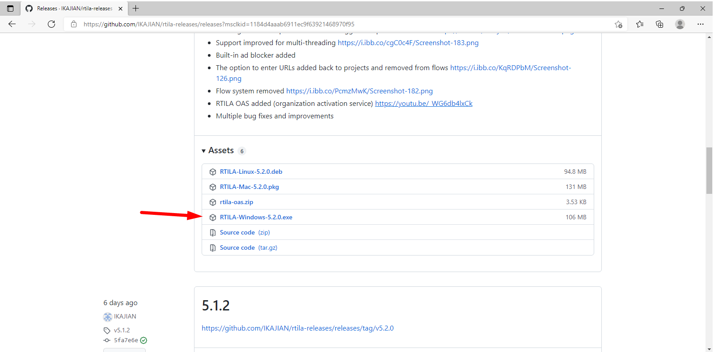

.. note::
    Those warnings are simply letting
    you know that the installation file is self-signed.

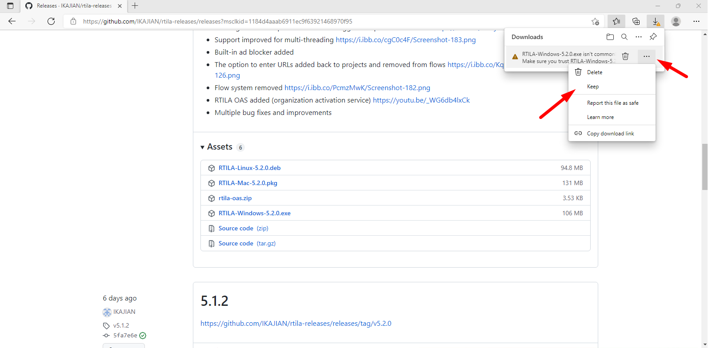

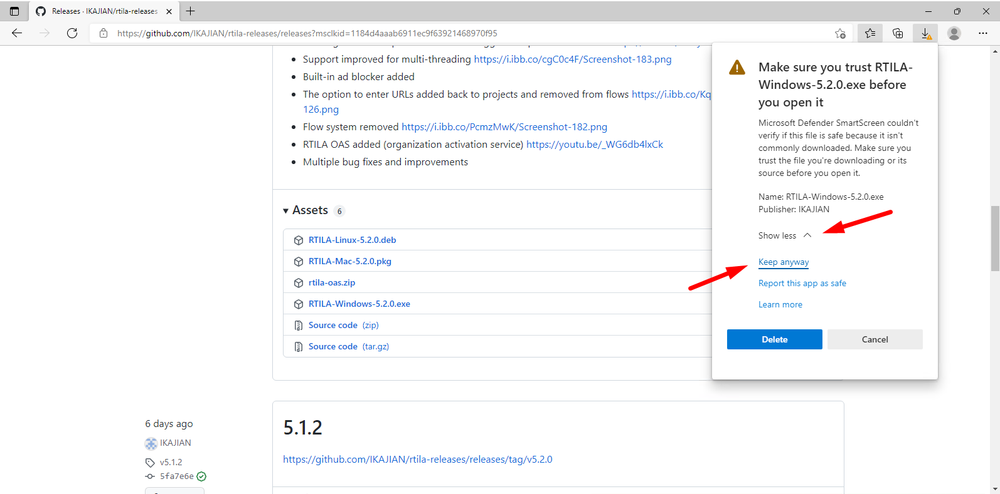

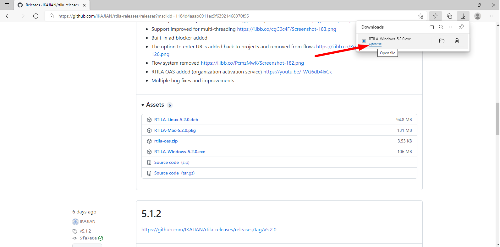

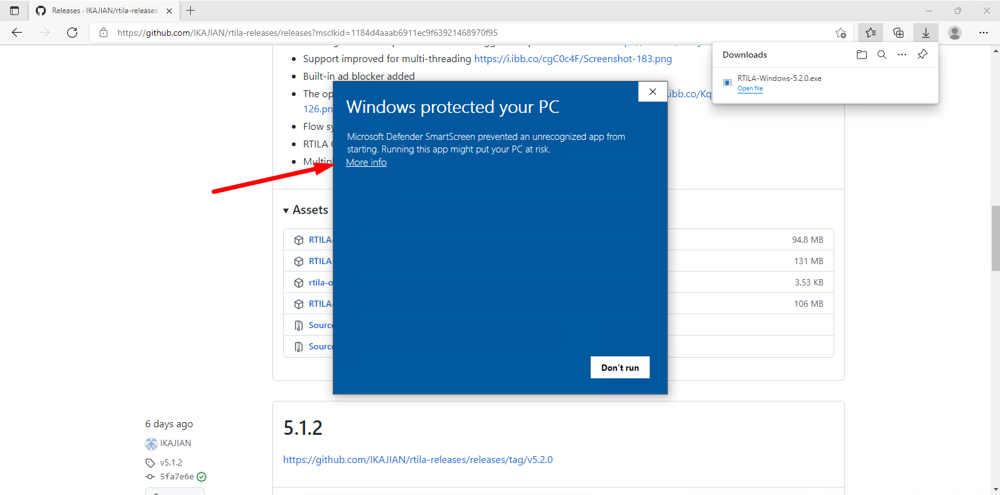

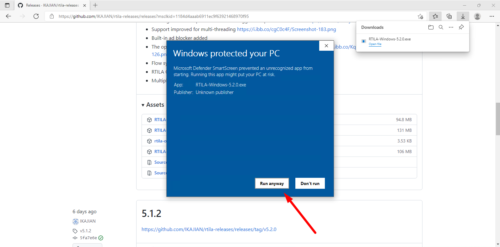

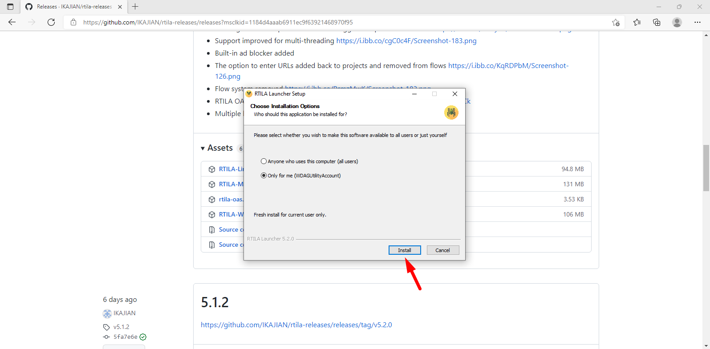

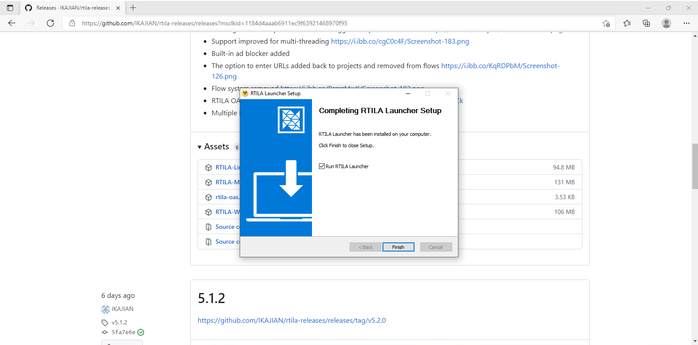

Activate and open the Launcher
------------------------------

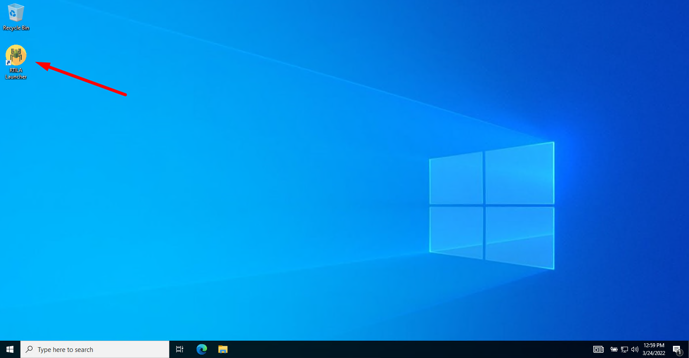

Once opened the program is accessed via the system tray.

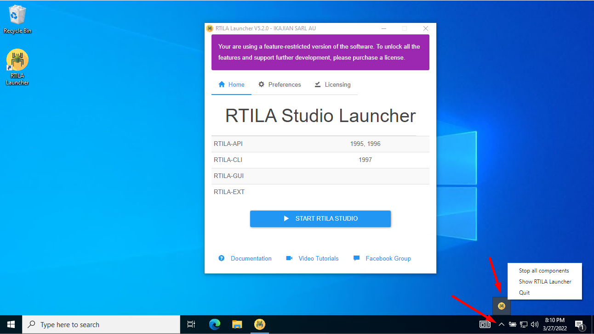

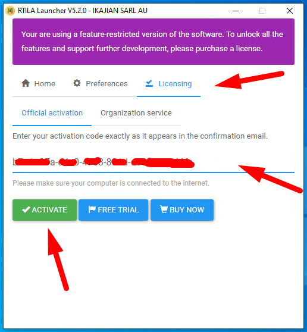

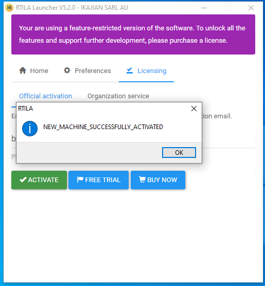

The software supports Microsoft Edge (by default on Windows), Google
Chrome and Chromium. Below are common paths for browser executables:

-  **Windows** : C:\\Program Files
   (x86)\\Google\\Chrome\\Application\\chrome.exe,
   C:\\Program Files\\Google\\Chrome\\Application\\chrome.exe,
   C:\\Program Files
   (x86)\\Microsoft\\Edge\\Application\\msedge.exe,
   C:\\Program Files\\Microsoft\\Edge\\Application\\msedge.exe.
-  **Mac** : /Applications/Google Chrome.app/Contents/MacOS/Google
   Chrome, /Applications/Chromium.app/Contents/MacOS/Chromium,
   /Applications/Microsoft Edge.app/Contents/MacOS/Microsoft Edge.
-  **Linux** : /usr/bin/google-chrome-stable, /usr/bin/chromium.

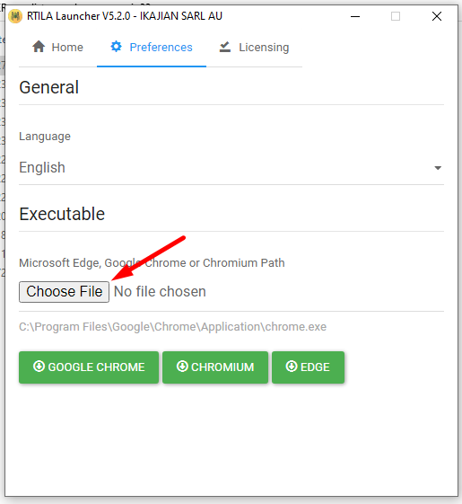

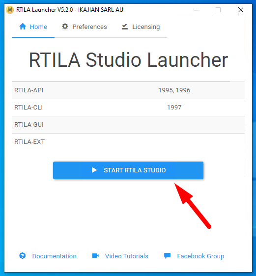

Allow the software through firewall on Windows.

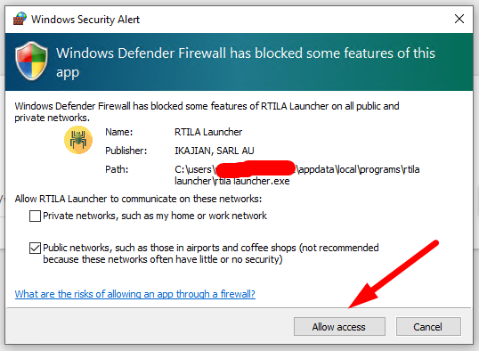

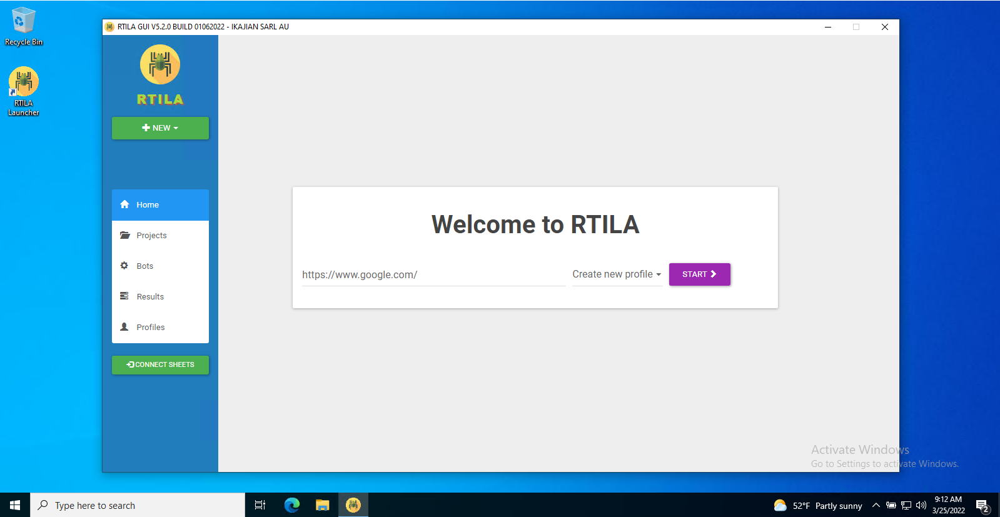