Integrations and autosave
=========================

The software uses a local database (rtila-database) in the application
data directory which by default points to:

-  ``%APPDATA%`` on Windows
-  ``$XDG_CONFIG_HOME`` or ``~/.config`` on Linux
-  ``~/Library/Application Support`` on macOS

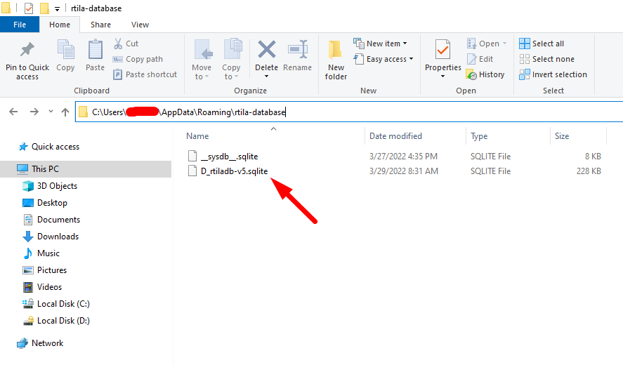

Cloud sheets
----------------------

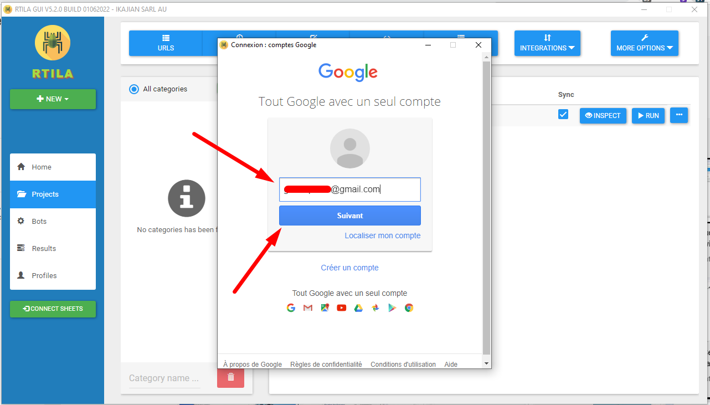

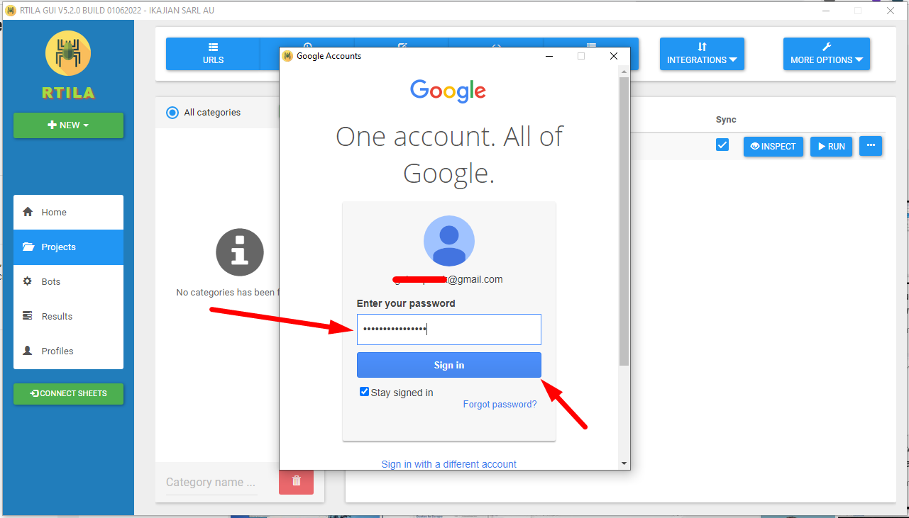

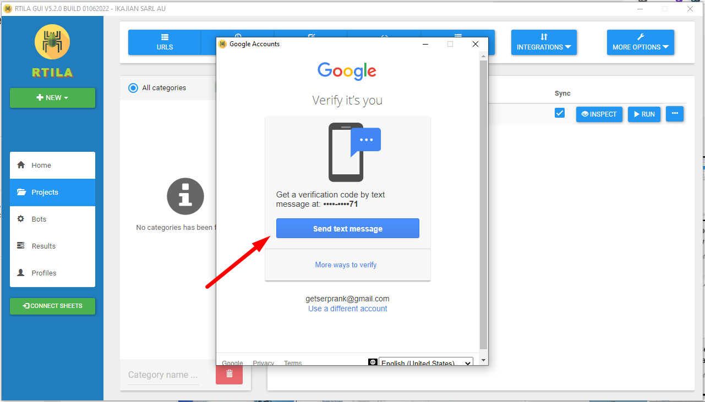

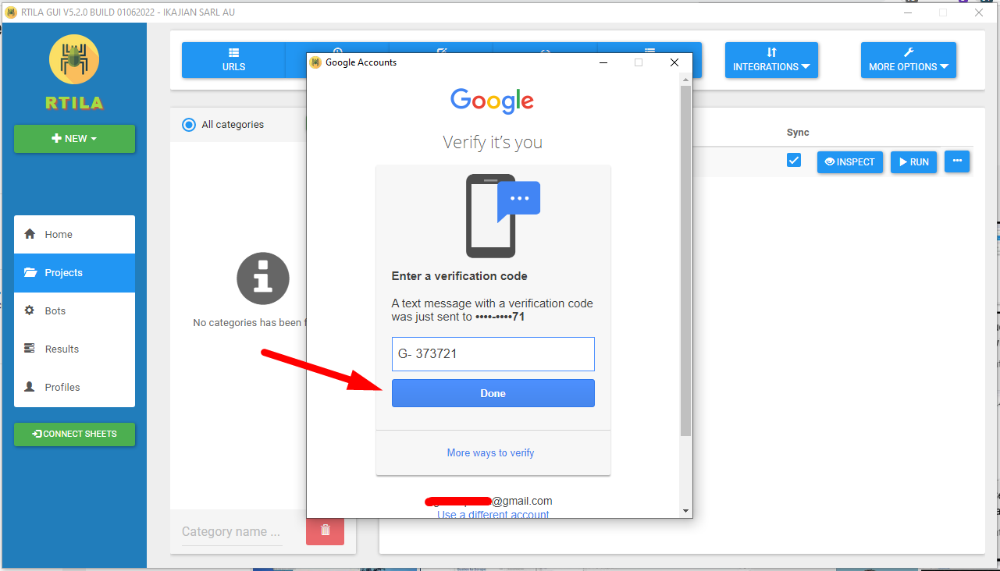

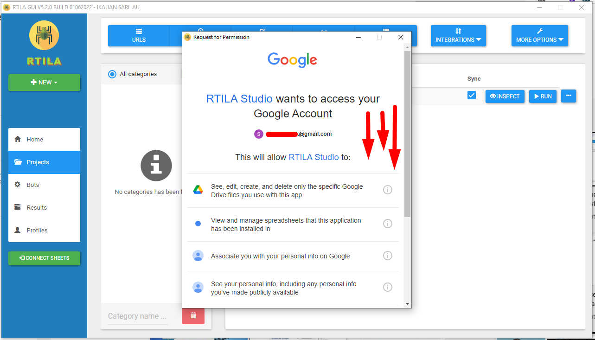

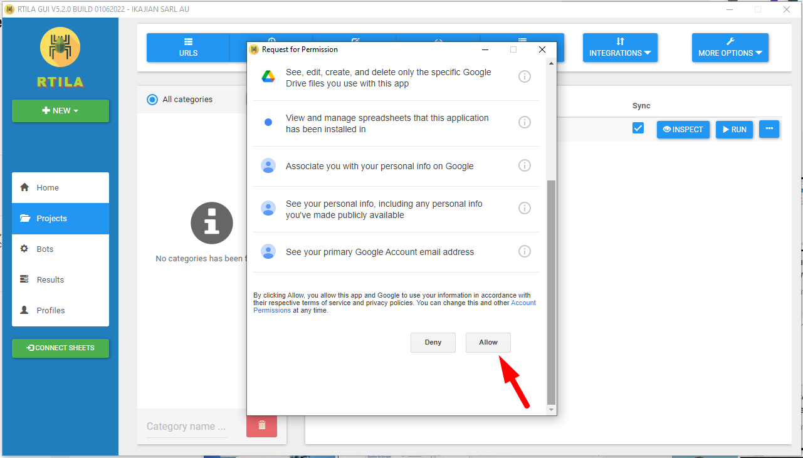

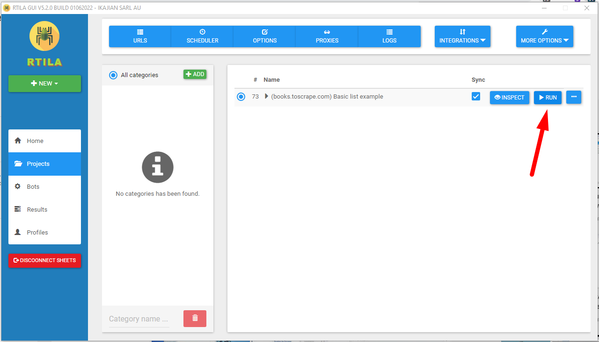

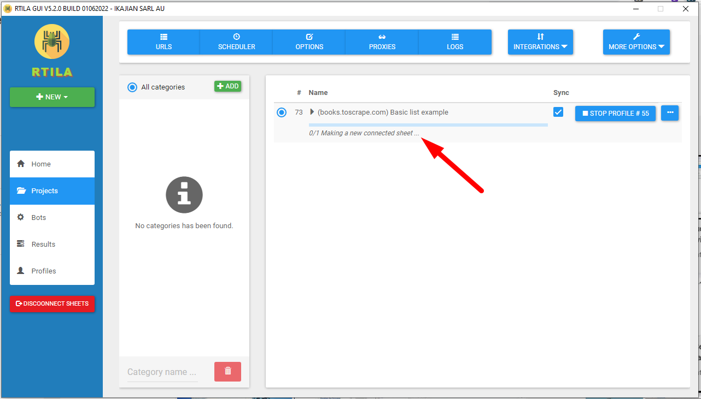

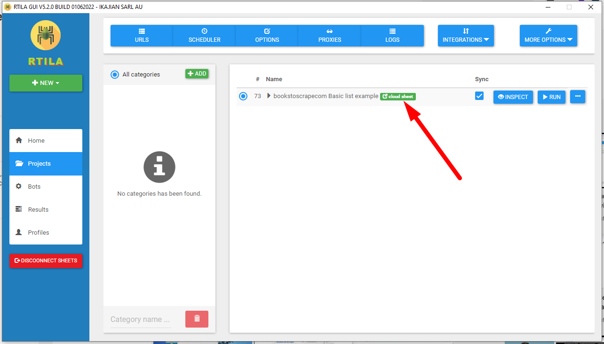

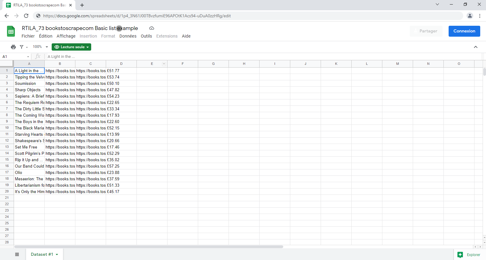

FTP/SFTP
--------

.. image:: ../Images/Screenshot_181.png

.. image:: ../Images/Screenshot_182.png

.. image:: ../Images/Screenshot_183.png

.. image:: ../Images/Screenshot_184.png

.. image:: ../Images/Screenshot_185.png

SMTP/Email
----------

.. image:: ../Images/Screenshot_186.png

.. image:: ../Images/Screenshot_187.png

.. image:: ../Images/Screenshot_188.png

.. image:: ../Images/Screenshot_189.png

.. image:: ../Images/Screenshot_190.png

.. image:: ../Images/Screenshot_191.png

Webhook
-------

.. image:: ../Images/Screenshot_192.png

.. image:: ../Images/Screenshot_193.png

.. image:: ../Images/Screenshot_194.png

::

   <?php

   file_put_contents("rtila-payload.json", file_get_contents("php://input"));

   ?>

.. image:: ../Images/Screenshot_195.png

.. image:: ../Images/Screenshot_196.png

.. image:: ../Images/Screenshot_197.png

Local file
----------

.. image:: ../Images/Screenshot_198.png

.. image:: ../Images/Screenshot_199.png

.. image:: ../Images/Screenshot_200.png

.. image:: ../Images/Screenshot_201.png

.. image:: ../Images/Screenshot_202.png

.. image:: ../Images/Screenshot_213.png