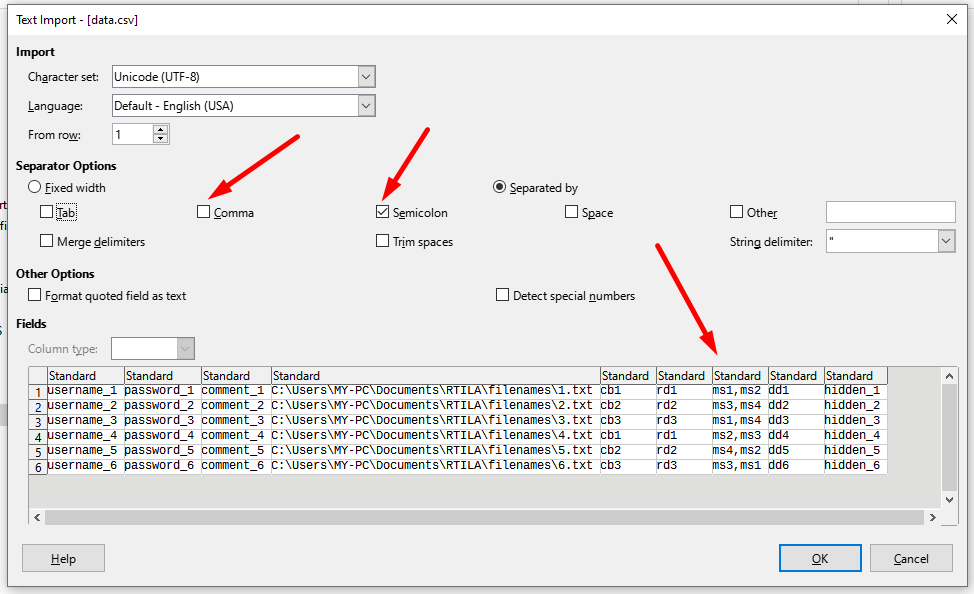
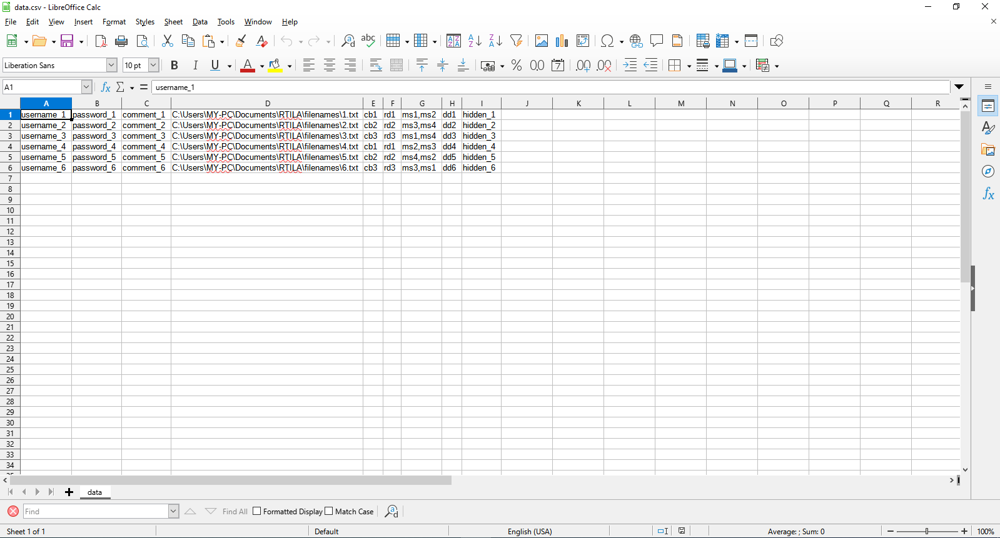
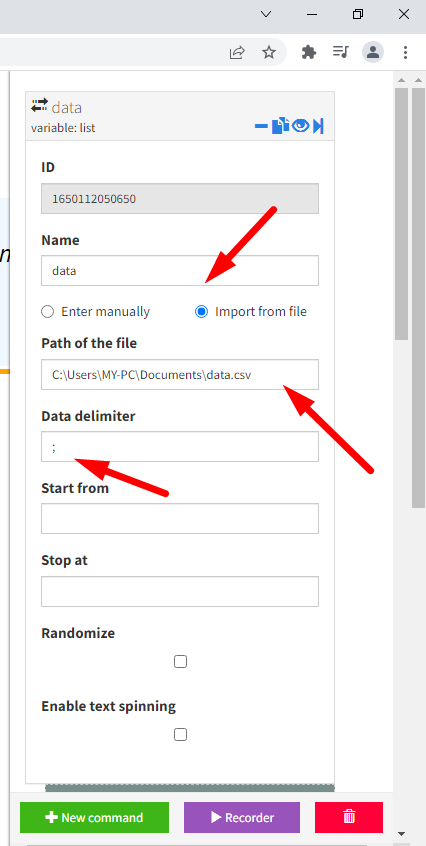
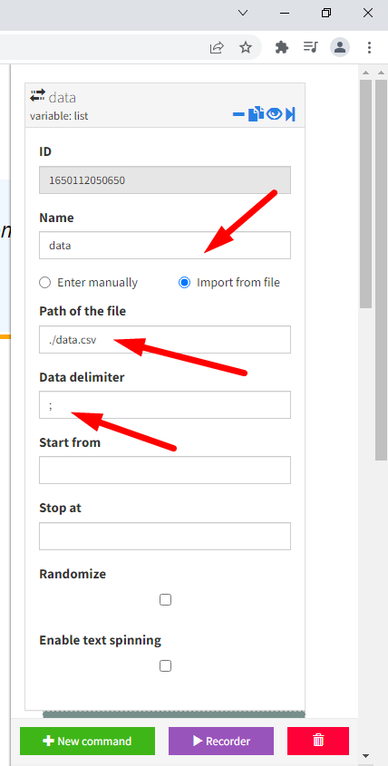
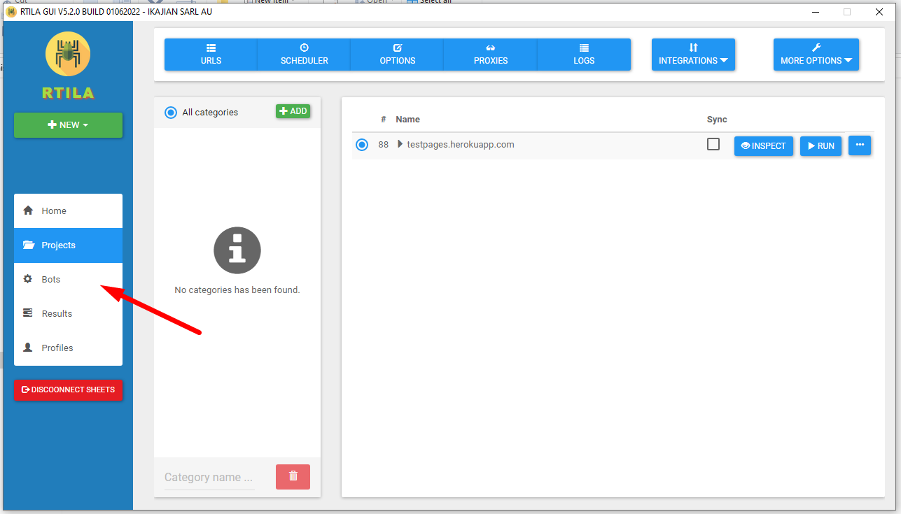
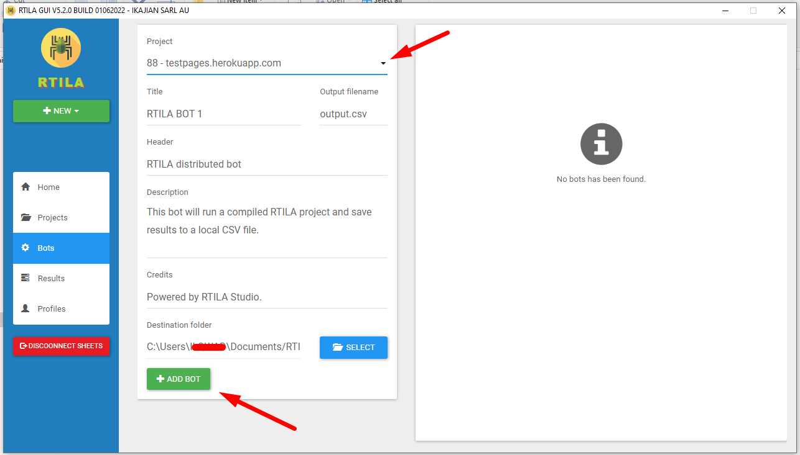
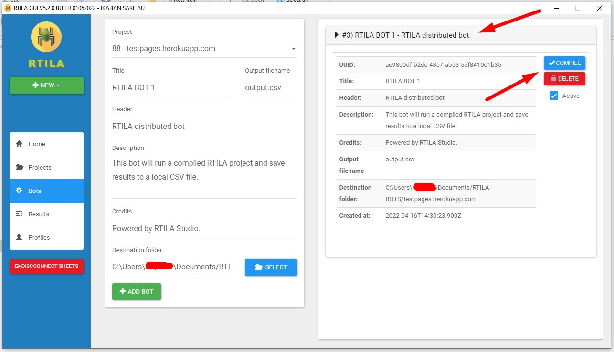
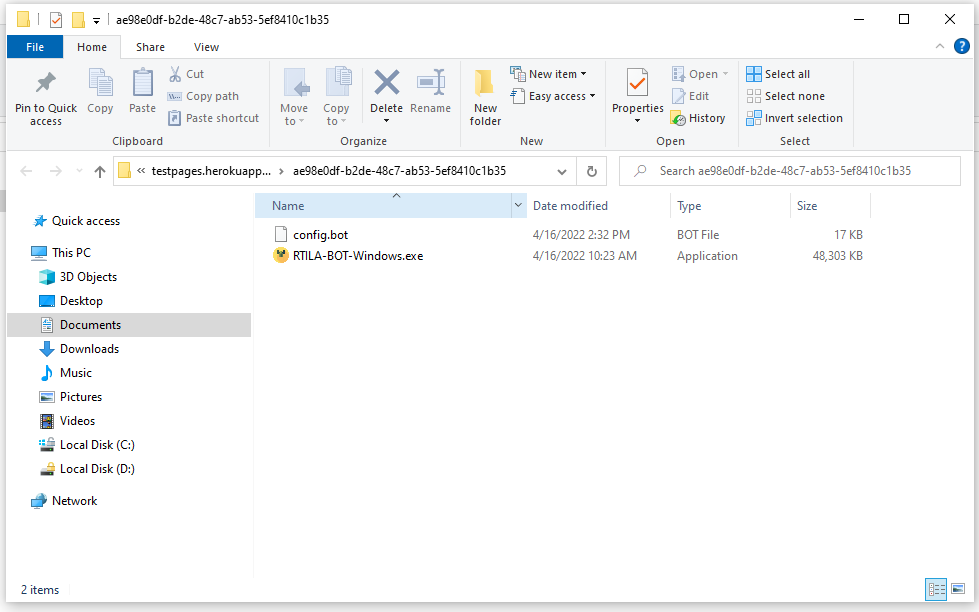
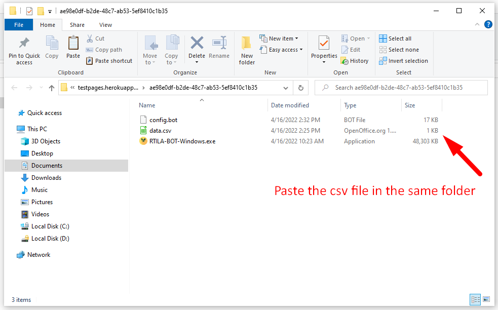

Pull data from a CSV file
=========================

.. toctree::
   index

All CSV and plain text files are supported. The Comma separator is used to work with multiple values so it's recommended to use other separators like Semicolon.

Absolute path
-------------

Absolute paths are for local projects, if you want to generate standalone bots you will need to specify relative paths.

Relative path
-------------

.. image:: ../../Images/Screenshot_374.png

