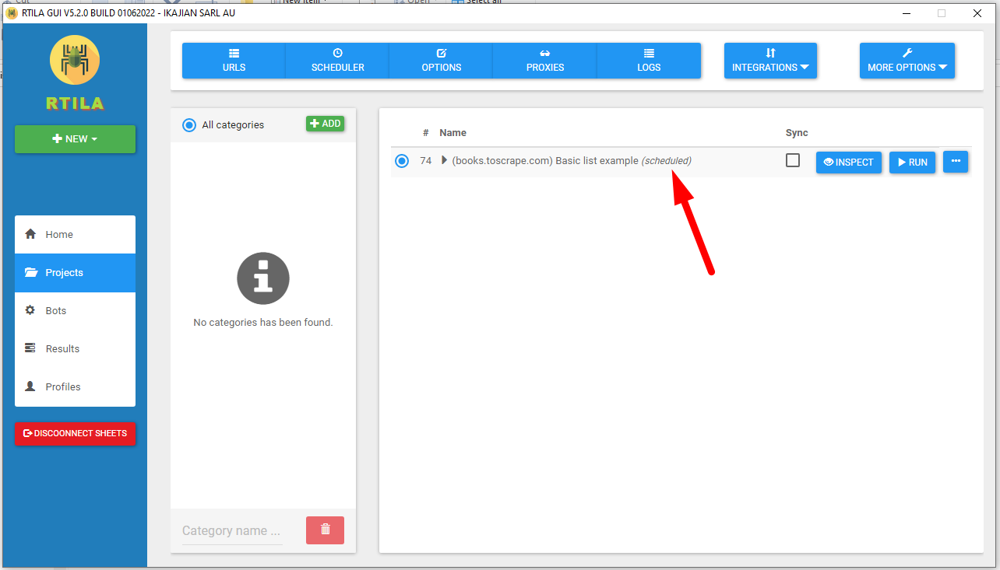

Schedule project runs
=====================

.. image:: ../Images/Screenshot_104.png

.. image:: ../Images/Screenshot_105.png

.. image:: ../Images/Screenshot_106.png

Monitor website changes
-----------------------

Changes can be monitored with the "Only extract new updates" strategy.

https://handbook.rtila.net/en/latest/8-datasets-and-grouped-data/index.html#dataset-strategies

Keep results of specific runs
-----------------------------

Projects can use the "purge results" feature to specify how many sessions can be kept.

https://handbook.rtila.net/en/latest/12-advanced-options/index.html#auto-purge-results-and-sessions