3 Create your first project
===========================

In this example we will use the main screen to create a new project.

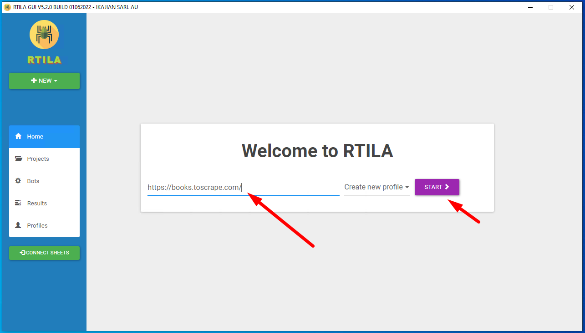

Projects can also be added with the sidebar dropdown button, with this
option the inspection button needs to be used manually.

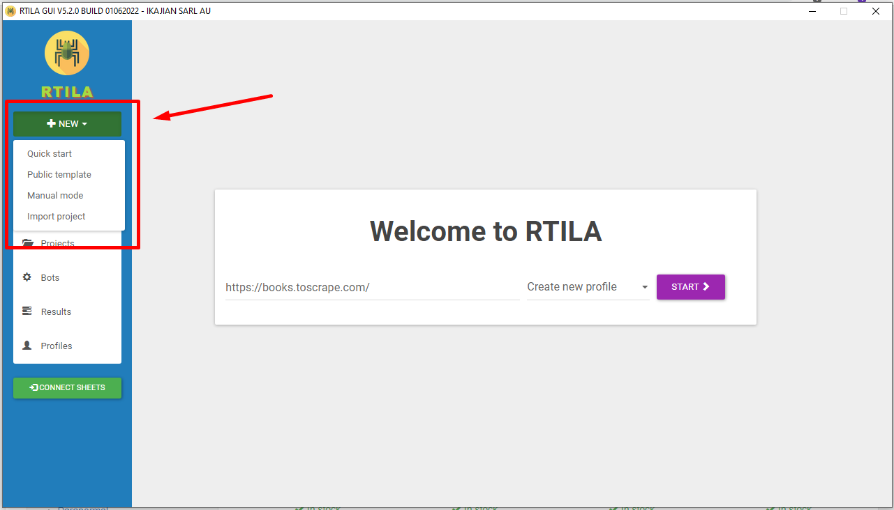

3-1 Use the browser extension
-----------------------------

The software contains its own packed browser extension which is loaded
automatically.

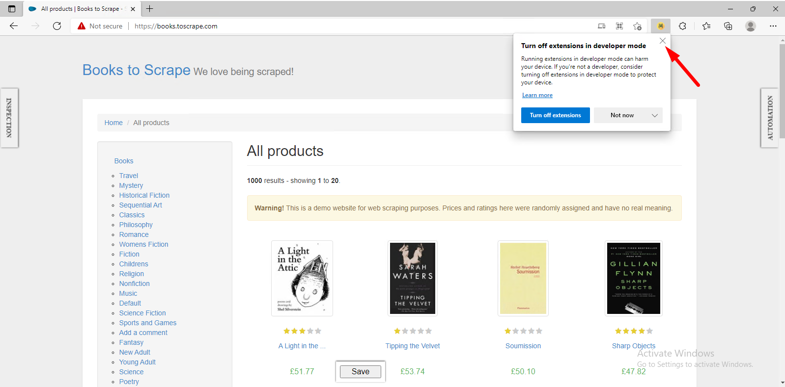

Both "Inspection" and "Automation" panels are hover-triggered expandable
sidebars.

.. image:: ../Images/Screenshot_221.png

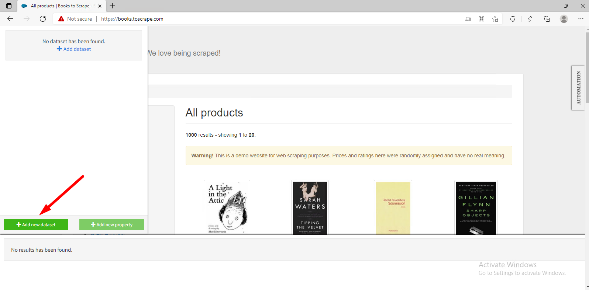

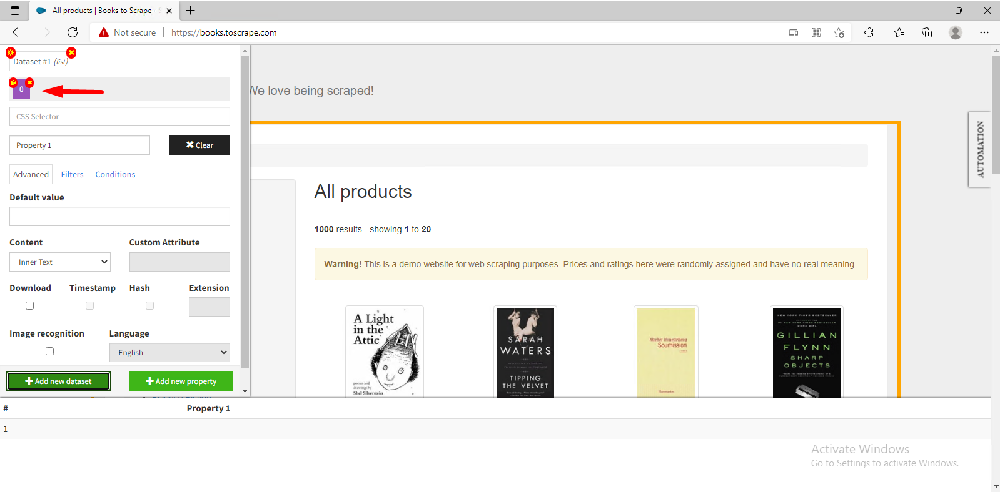

Once a property is created or selected, the navigation mode is disabled
and replaced with a point-and-click interface. To switch back to the
navigation mode, you can click again on the selected property or use the
contextmenu.

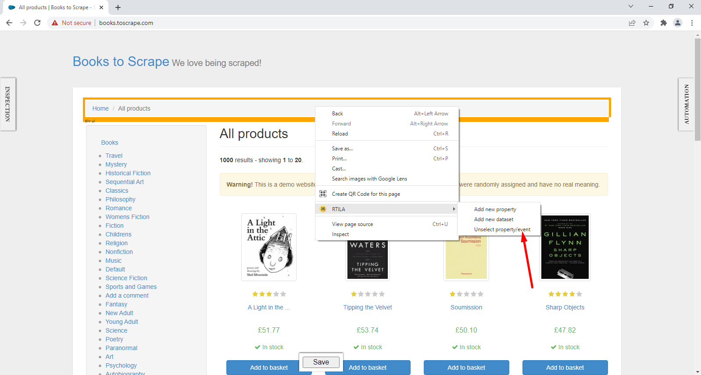

Click on the element you want to select. The software will make a first
guess at what CSS selector you want. It's likely to be bad since it only
has one example to learn from, but it's a start. Elements that match the
selector will be highlighted in yellow.

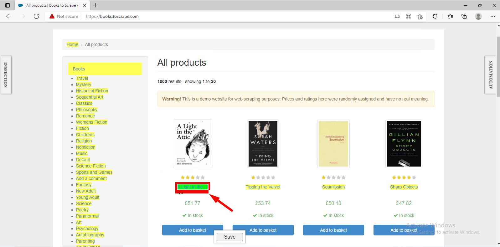

Click on elements that shouldn't be selected. They will turn red. Click
on elements that should be selected. They will turn green.

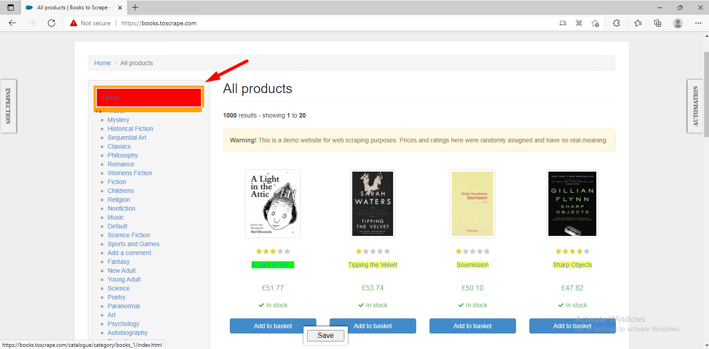

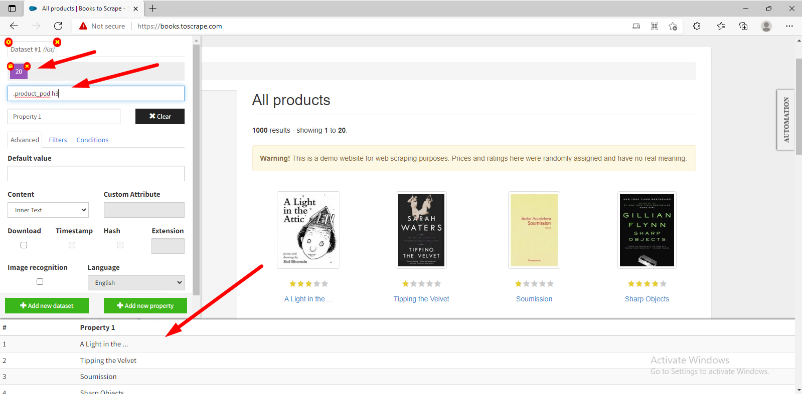

Selected element can be customized by changing manually its CSS
selector. Check this CSS selector reference page for more details:
https://www.w3schools.com/cssref/css_selectors.asp

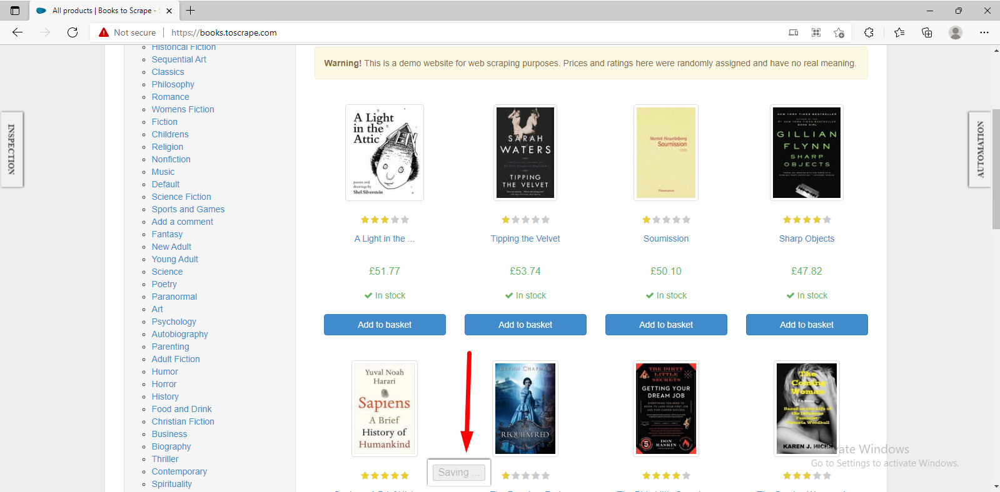

3-2 Start a project
-------------------

The software uses a local database (rtila-database) in the application
data directory which by default points to:

-  ``%APPDATA%`` on Windows
-  ``$XDG_CONFIG_HOME`` or ``~/.config`` on Linux
-  ``~/Library/Application Support`` on macOS

.. image:: ../Images/Screenshot_107.png

**Run a project manually**

**Create a scheduled project**

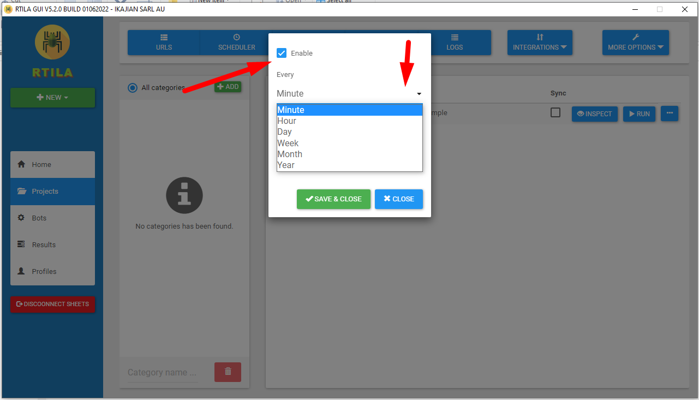

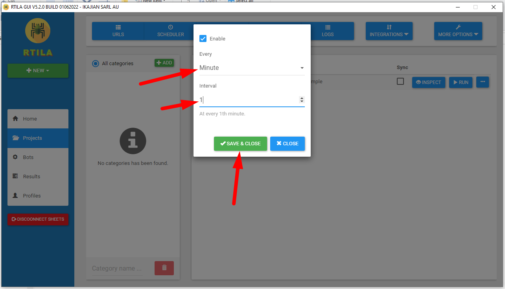

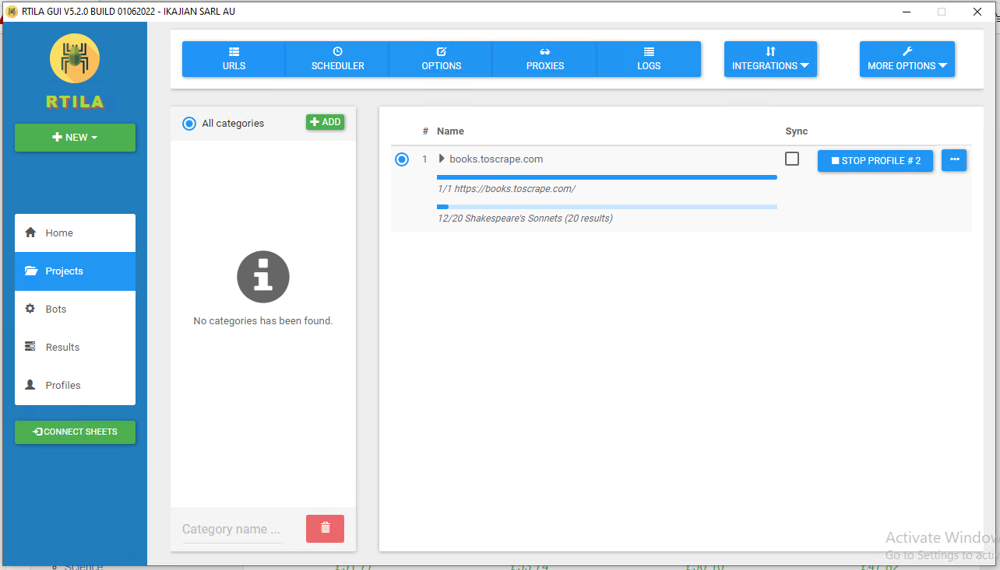

3-3 Preview and export results
------------------------------

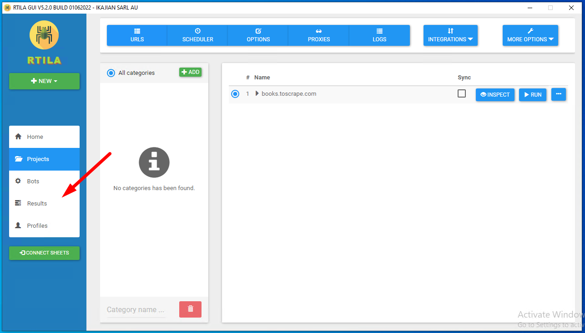

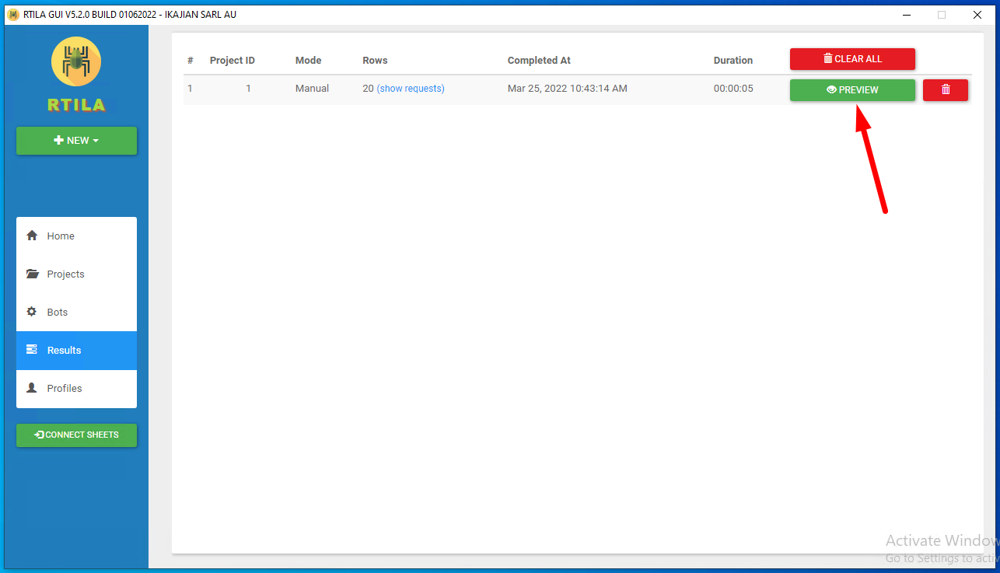

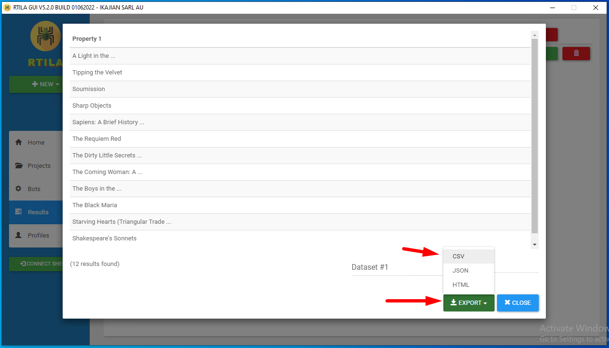

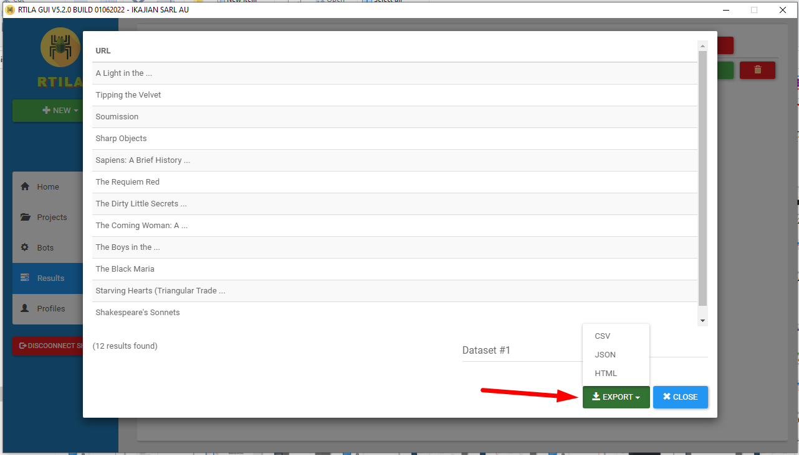

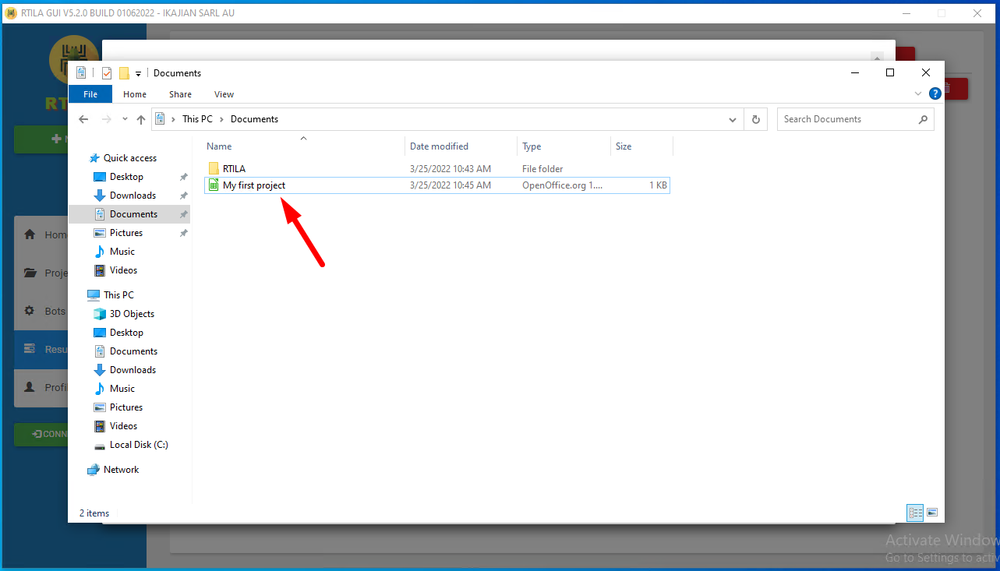

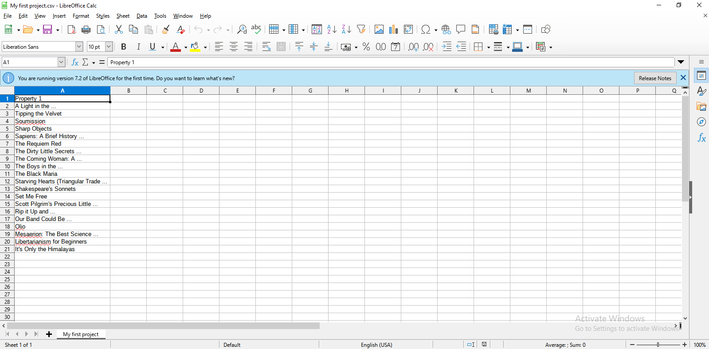