.. role:: raw-latex(raw)
   :format: latex
..

.. contents::
   :depth: 3
..

5 Automate browser tasks
========================

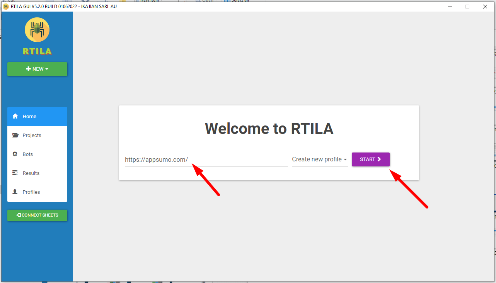

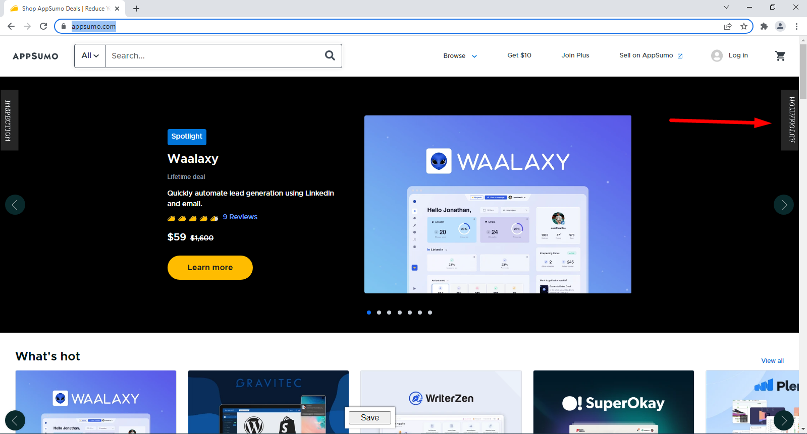

5-1 Record user behavior
------------------------

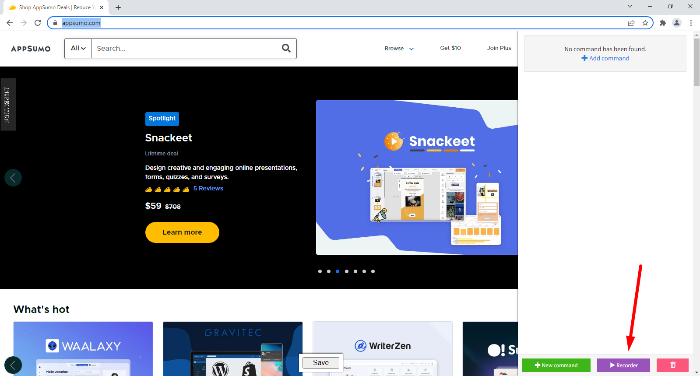

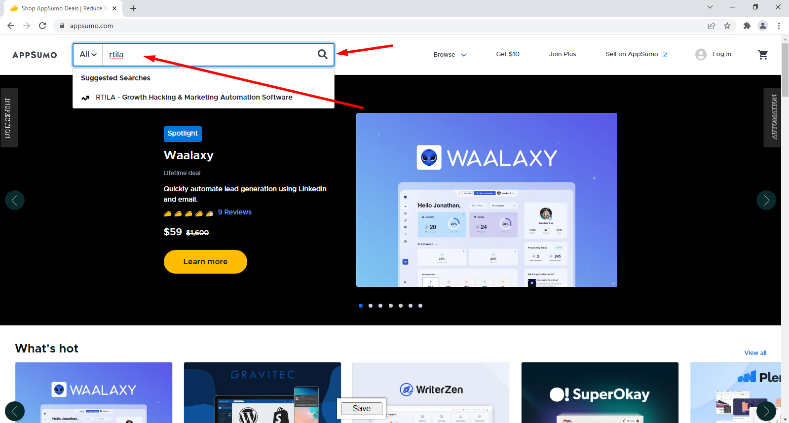

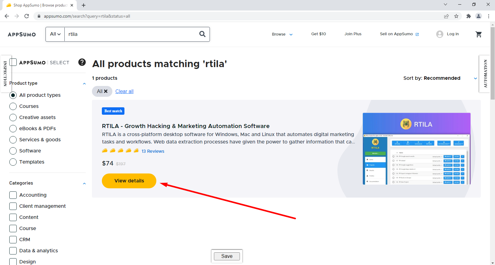

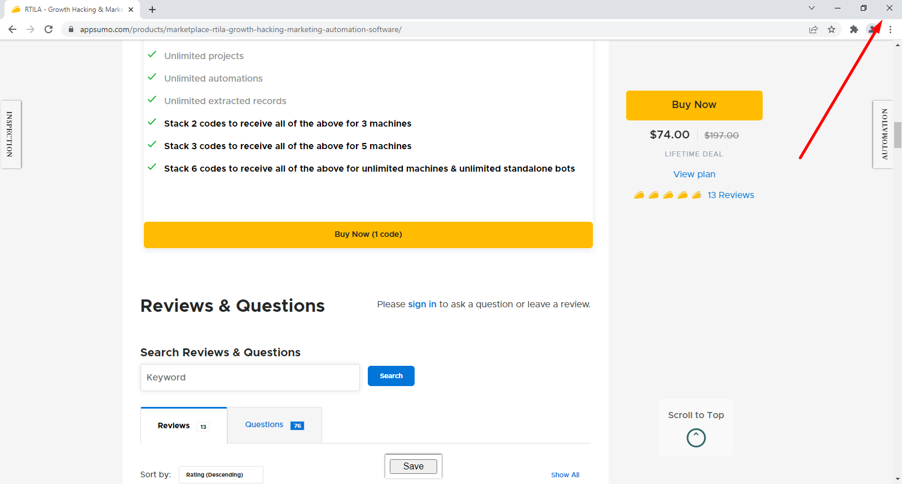

5-2 Run recorded project
------------------------

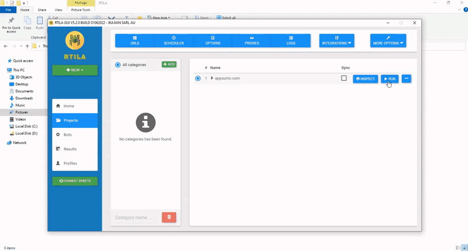

.. image:: ./Videos/Screencast_1.mp4

5-3 Use dynamic values
----------------------

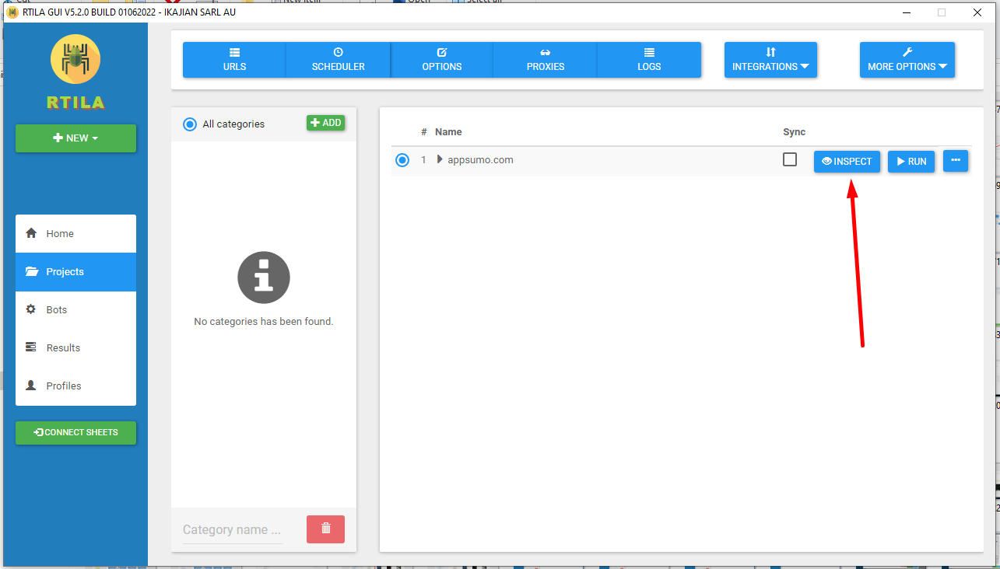

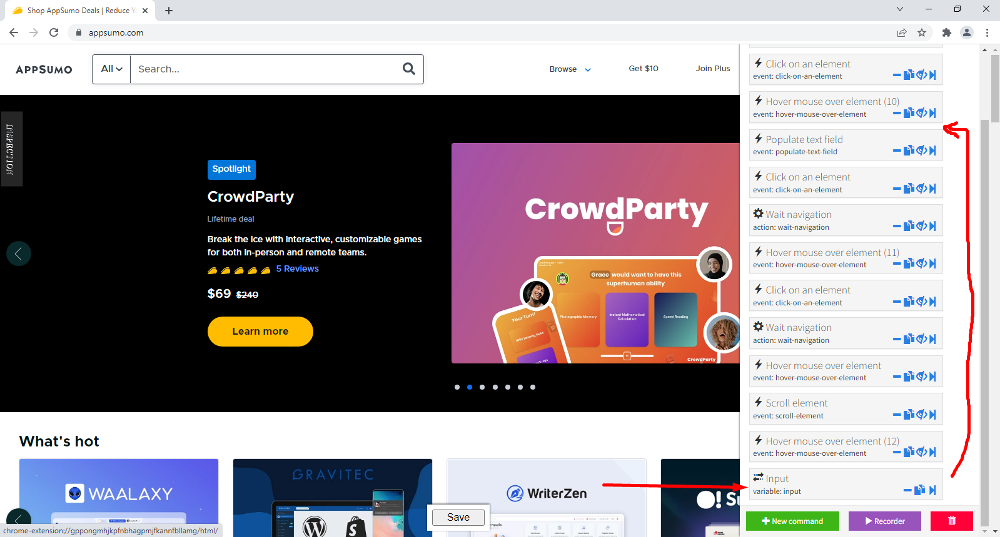

.. image:: ../Images/Screenshot_93.png

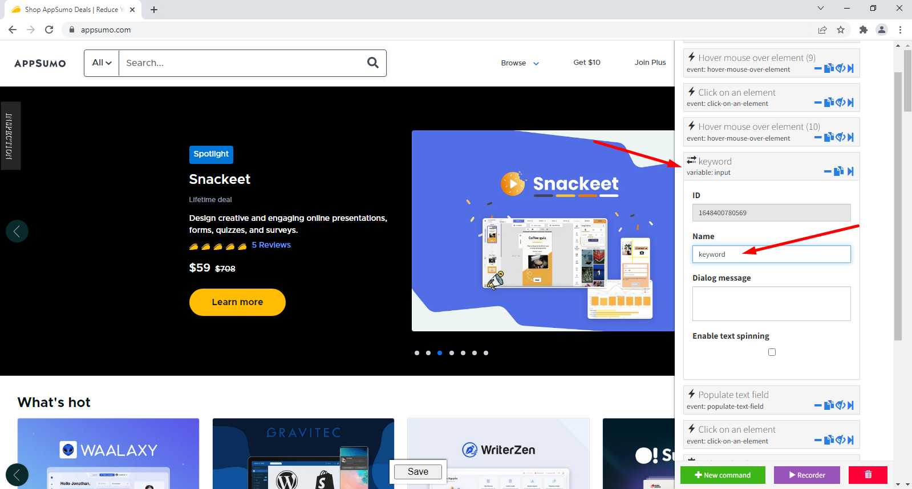

::

   {{variable_name}}

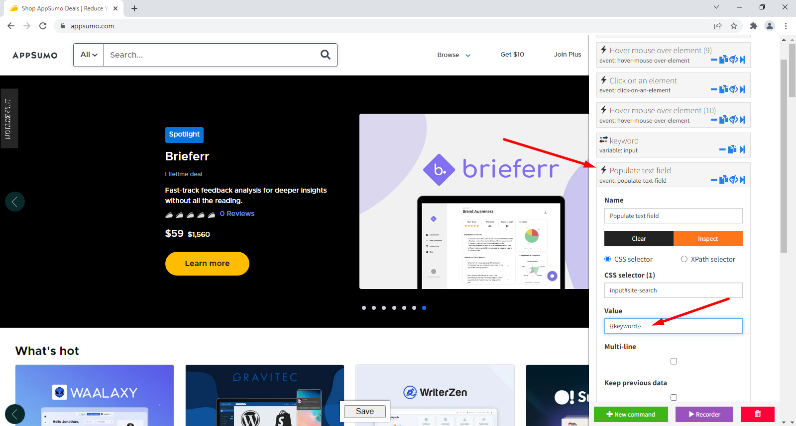

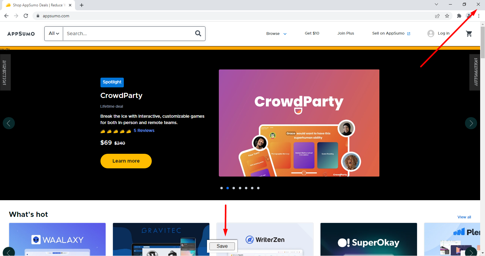

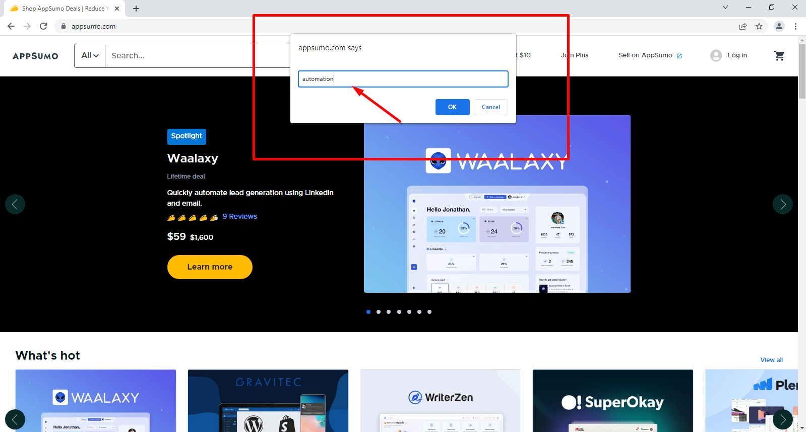

