Generate standalone bots
========================

Import a public template
------------------------

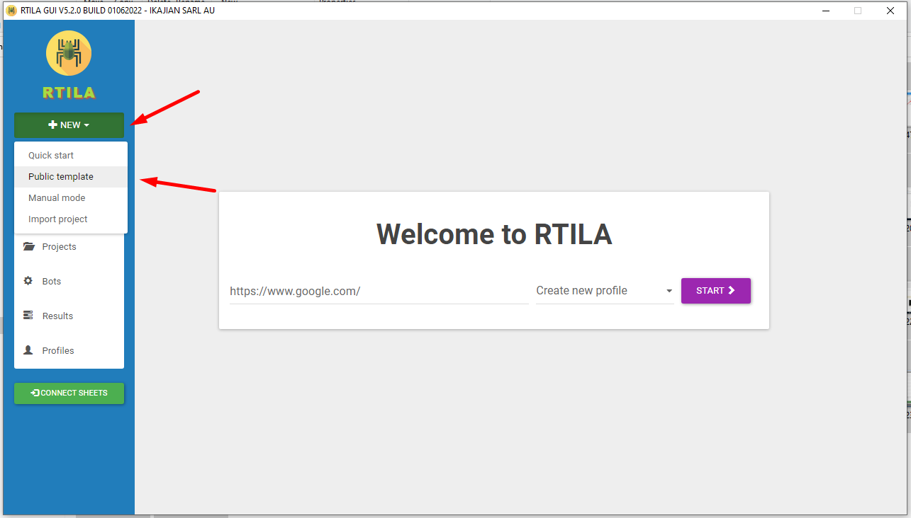

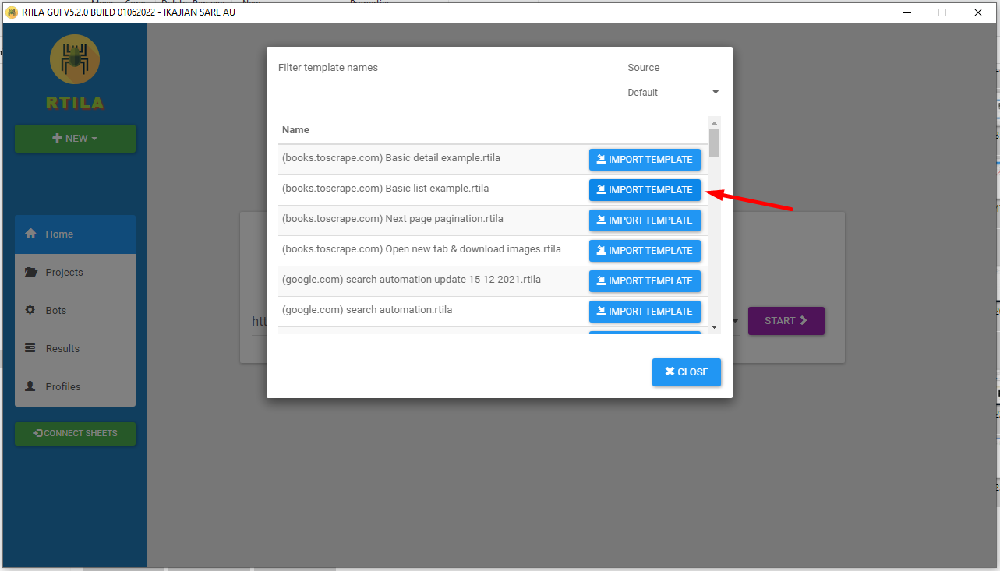

Add new bot
-----------

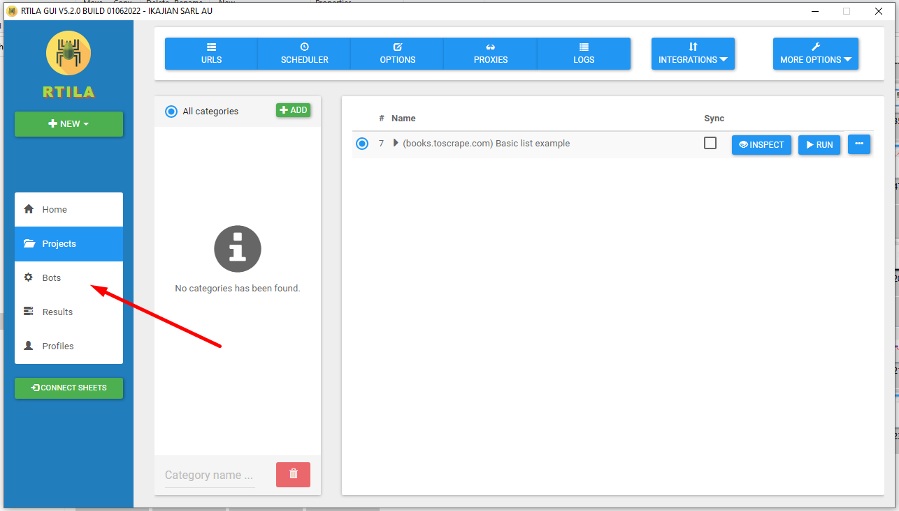

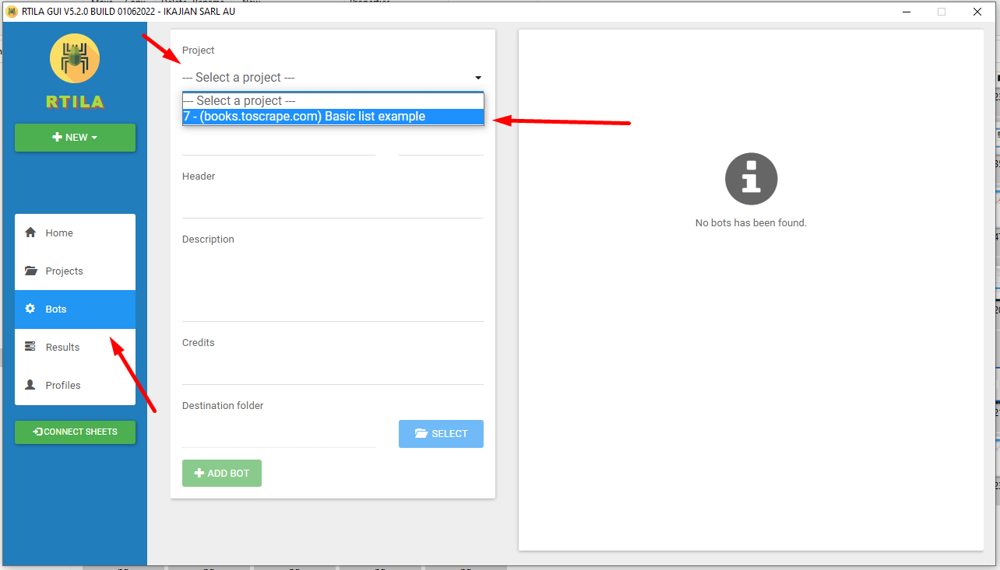

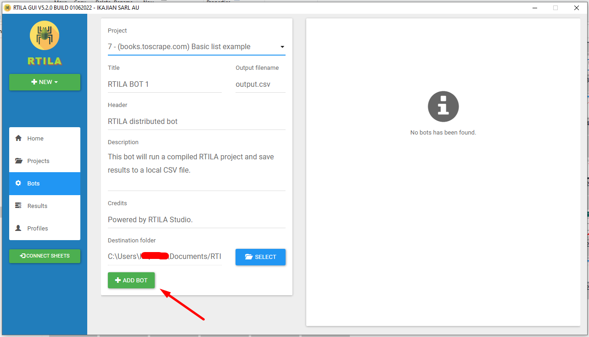

Compile added bot
-----------------

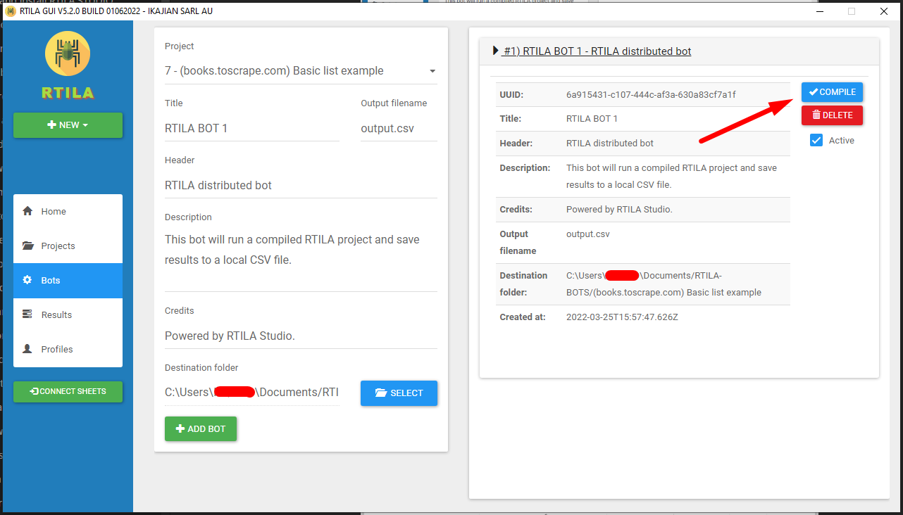

Execute compiled bot
--------------------

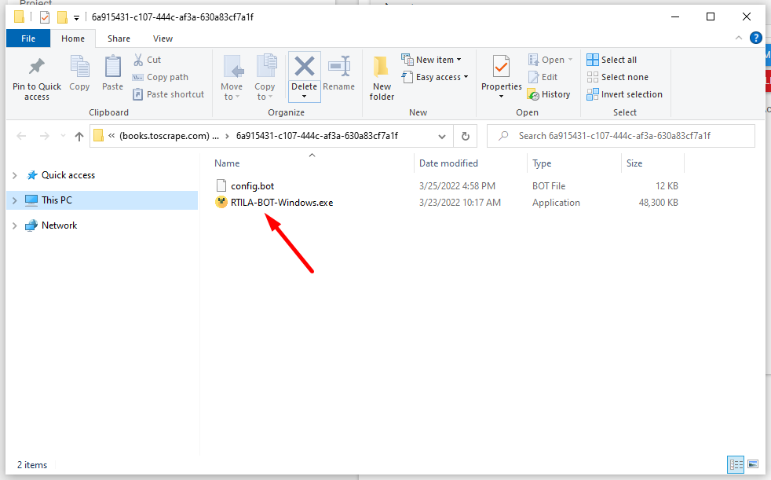

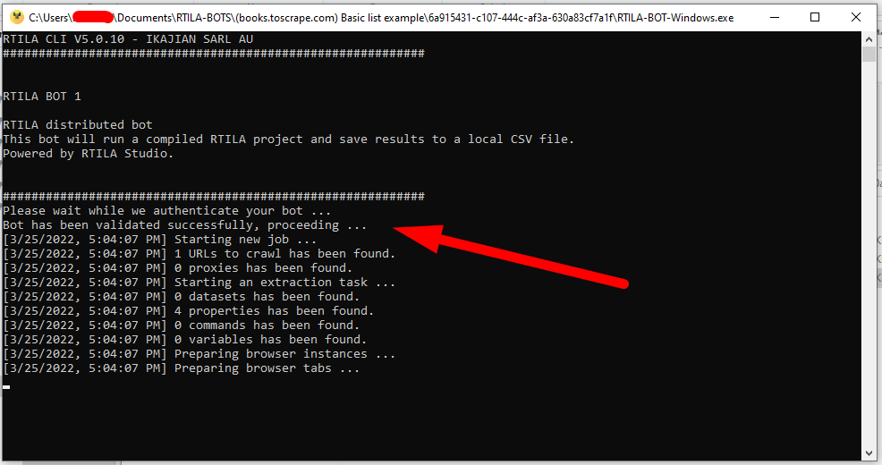

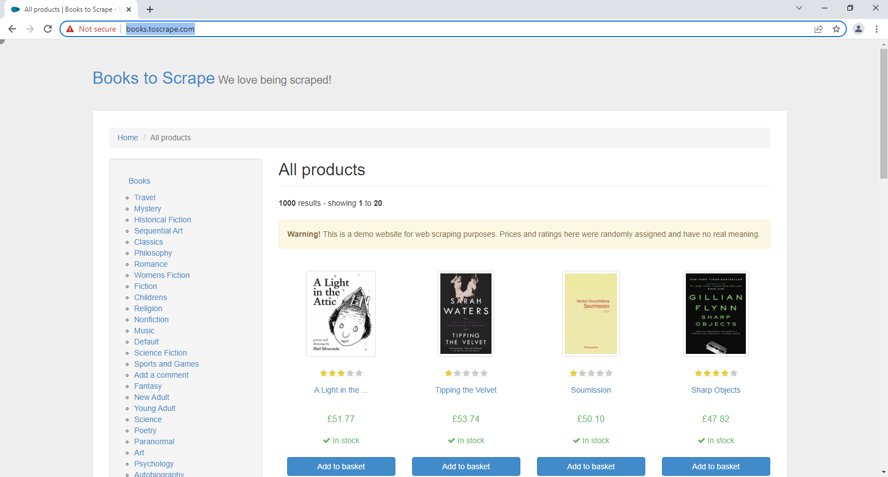

Open output file
----------------

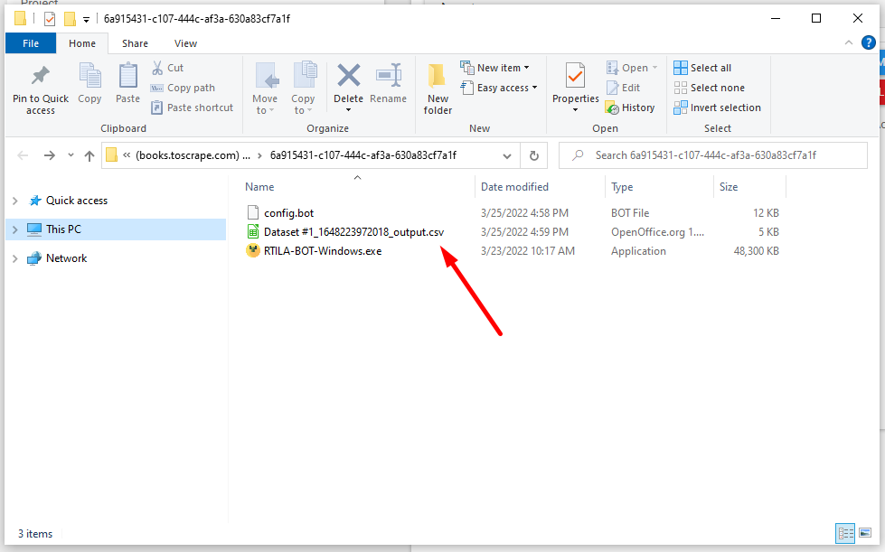

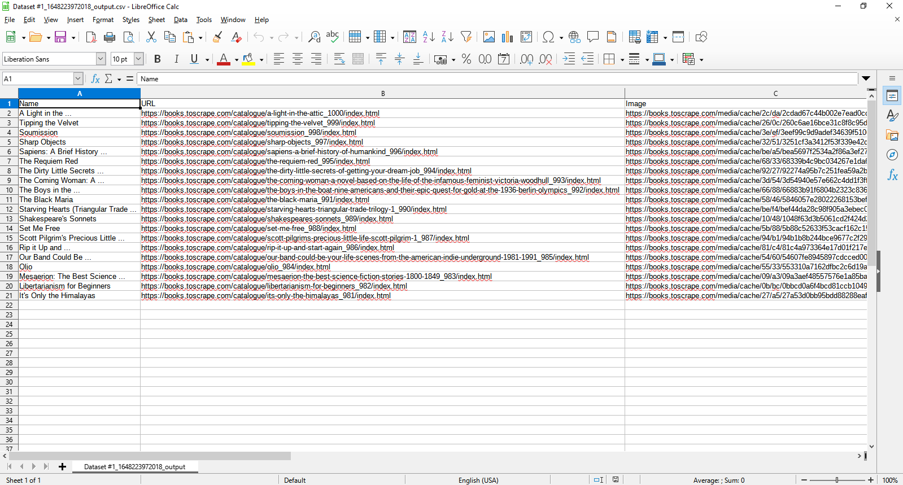

Deactivate a bot
----------------

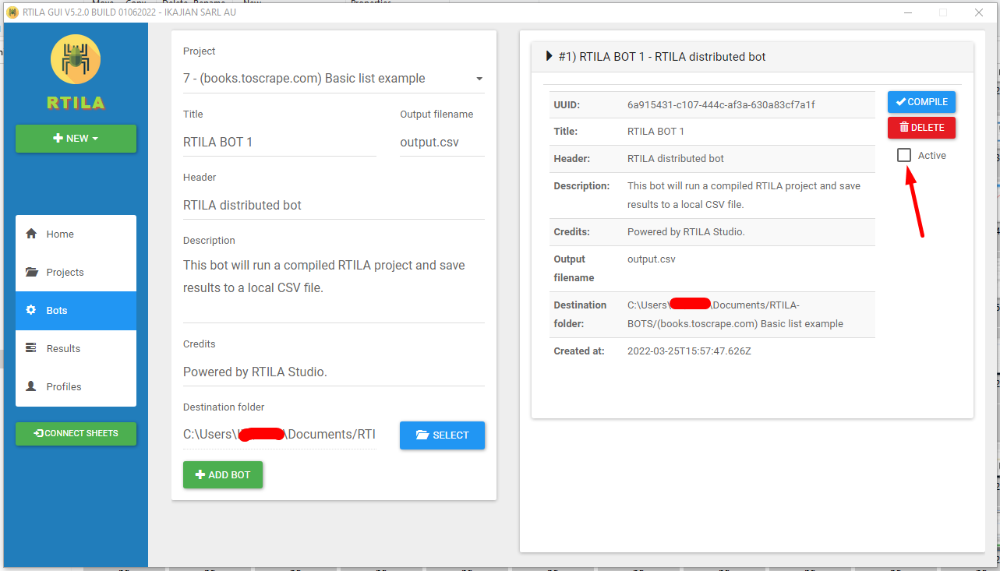

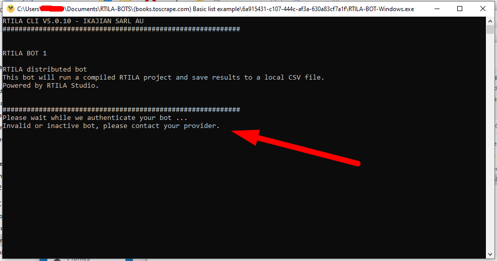

White-label bots
----------------

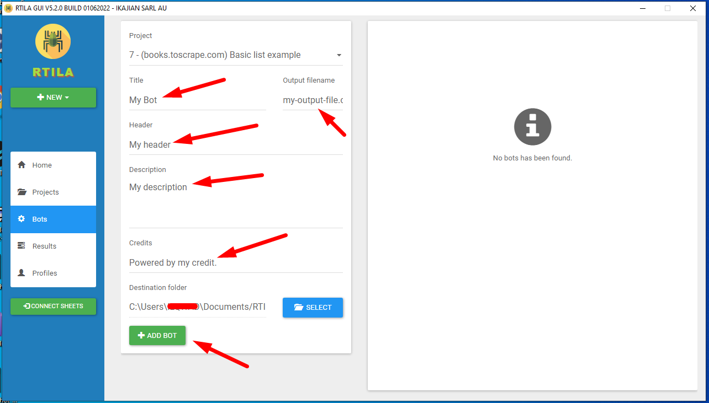

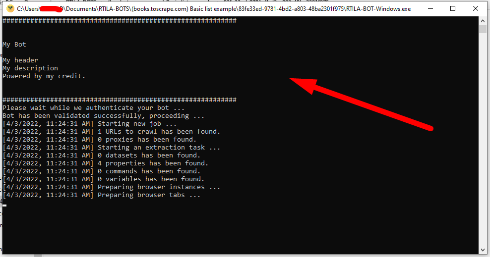