9 Scrape multiple URLs
======================

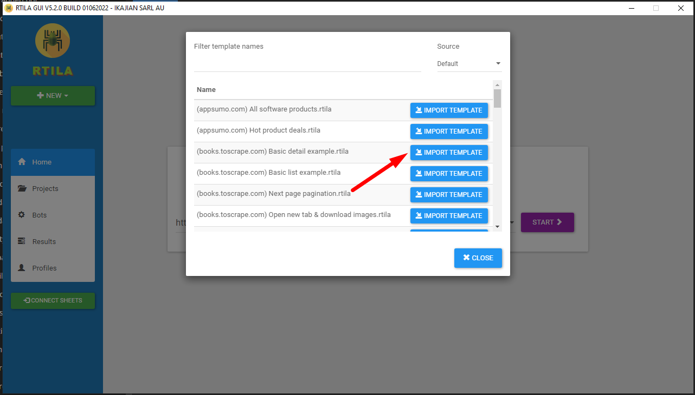

.. image:: ../Images/Screenshot_137.png

9-1 Add manual entries
----------------------

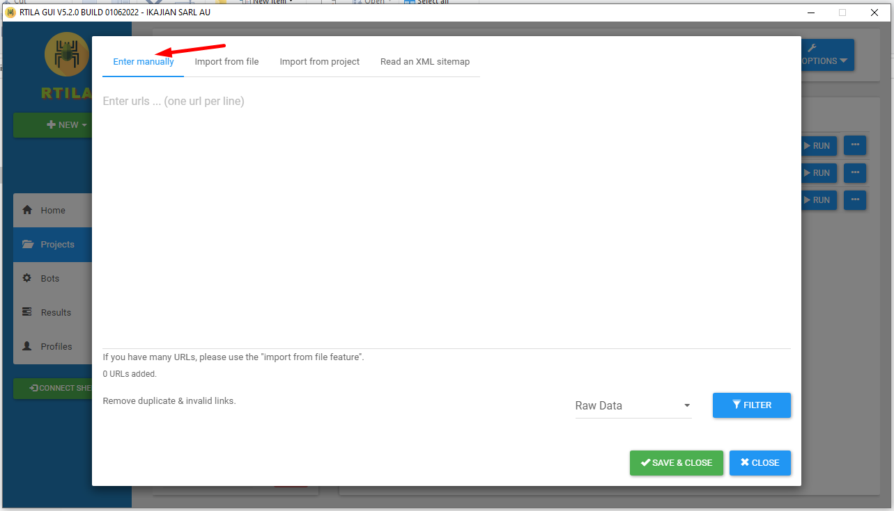

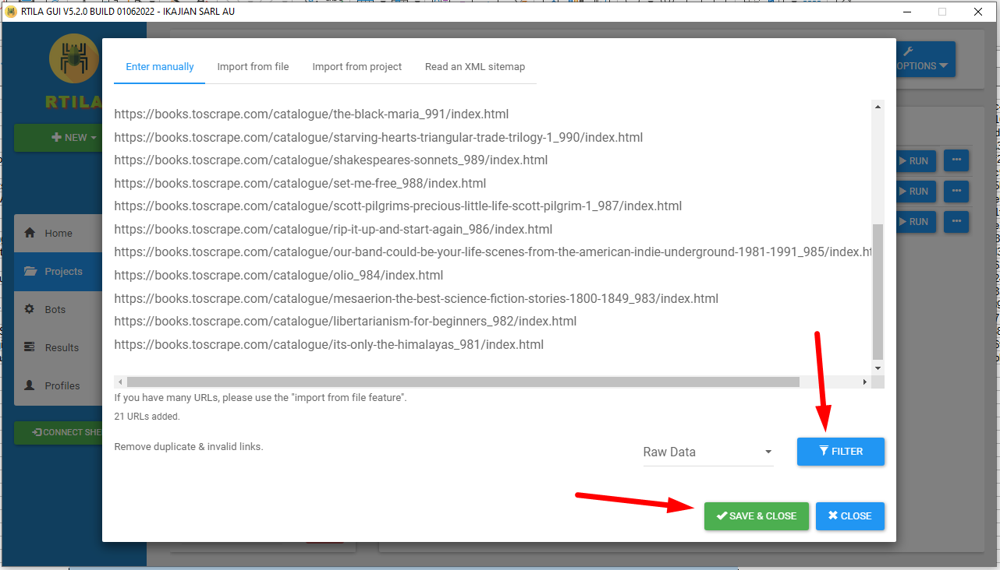

9-2 Import from file
--------------------

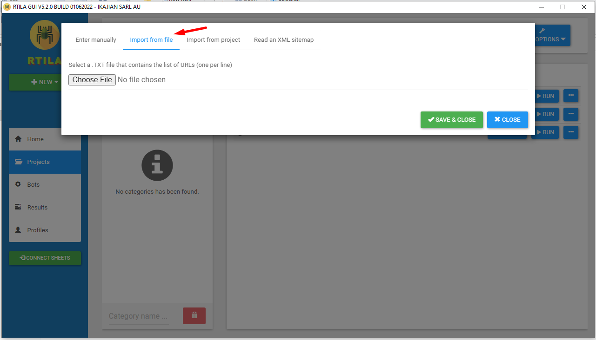

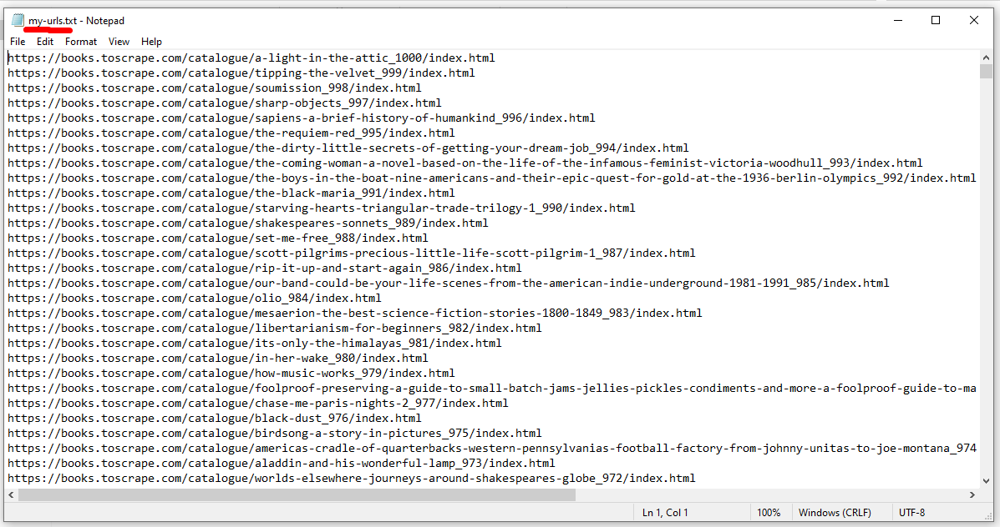

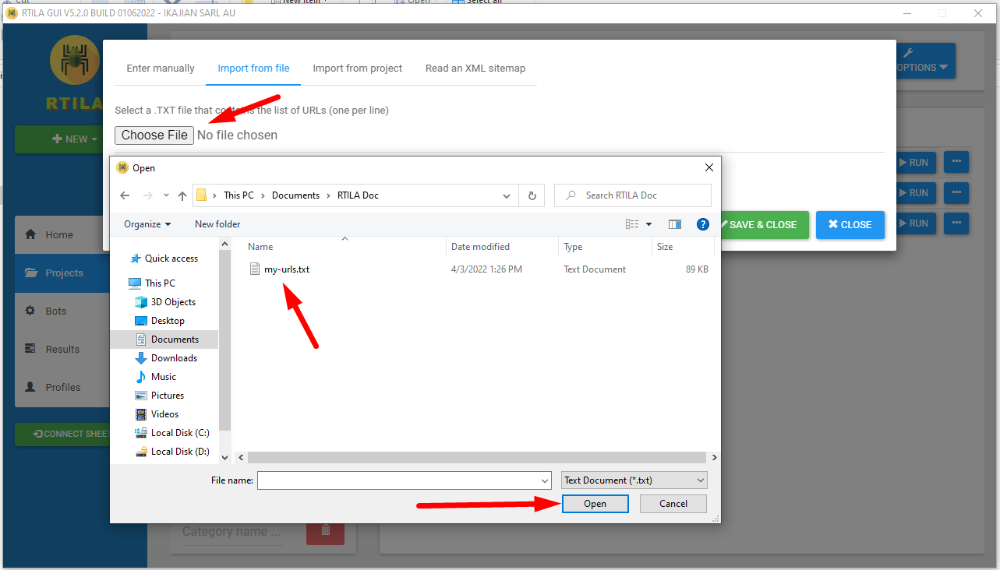

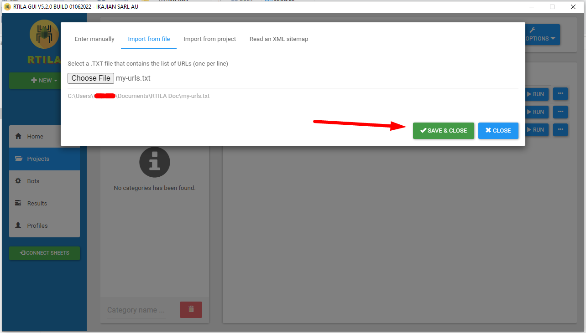

9-3 Import from project
-----------------------

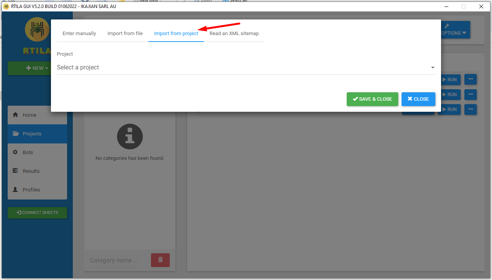

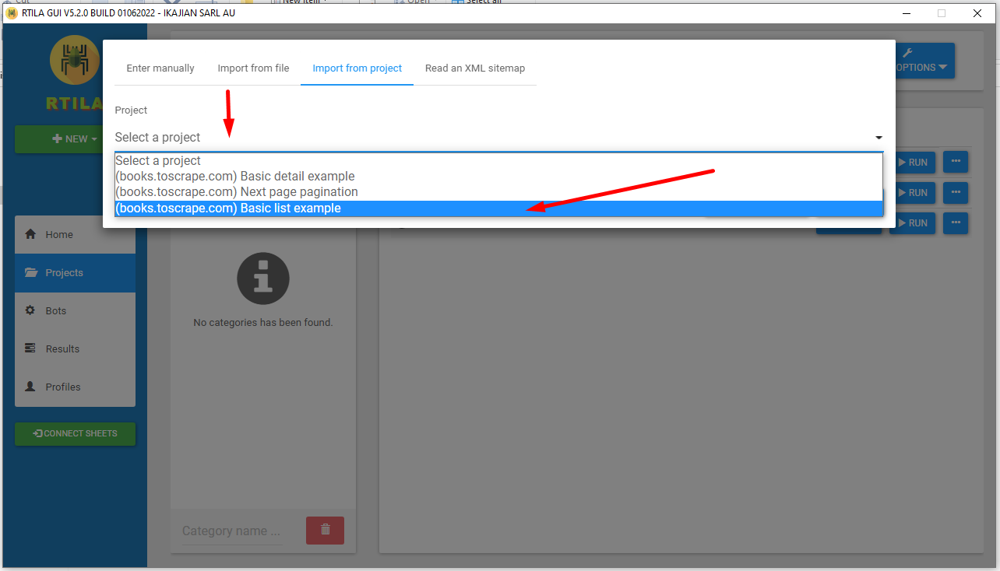

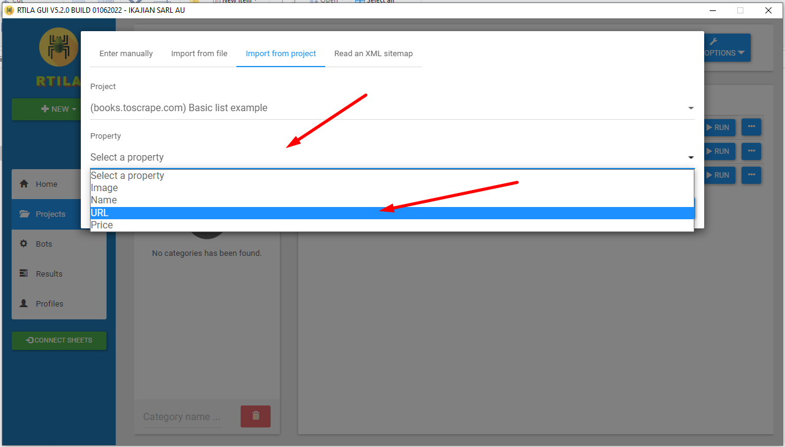

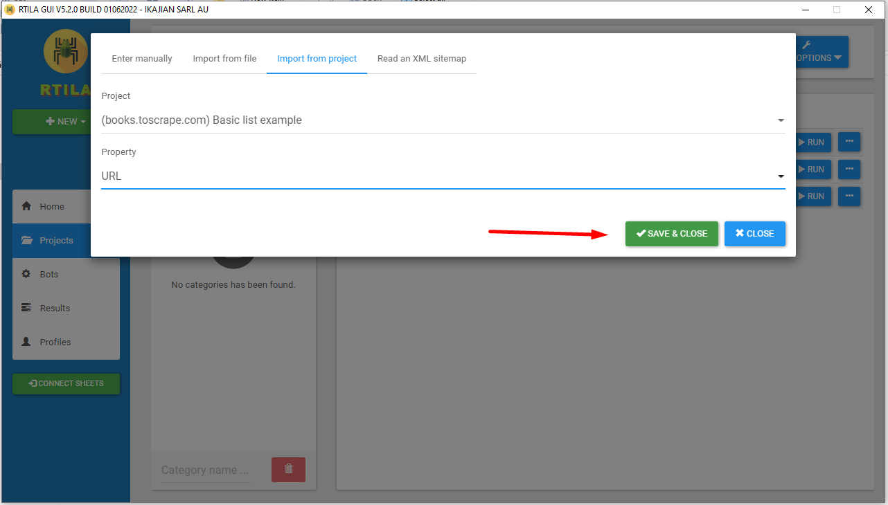

9-4 Read XML sitemap
--------------------

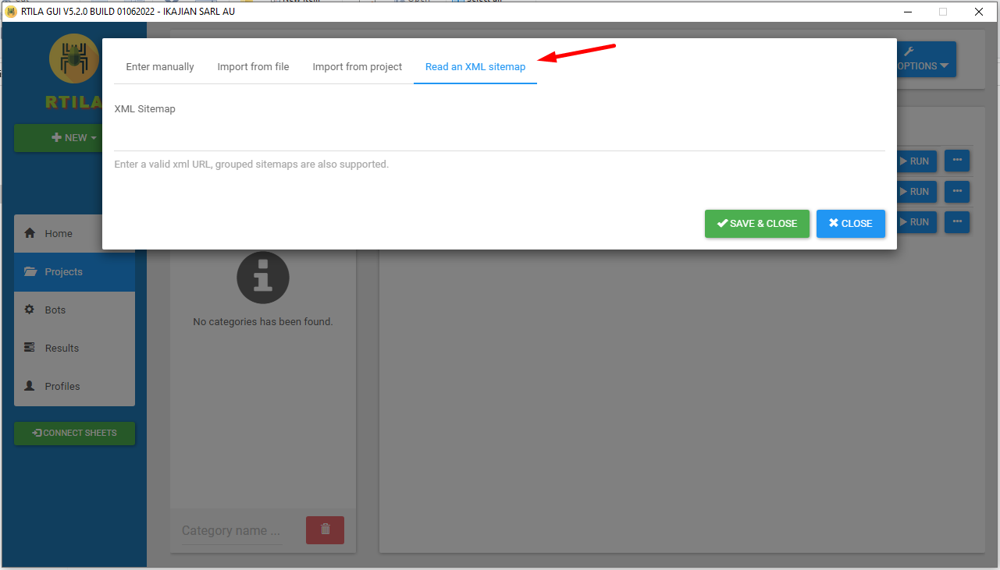

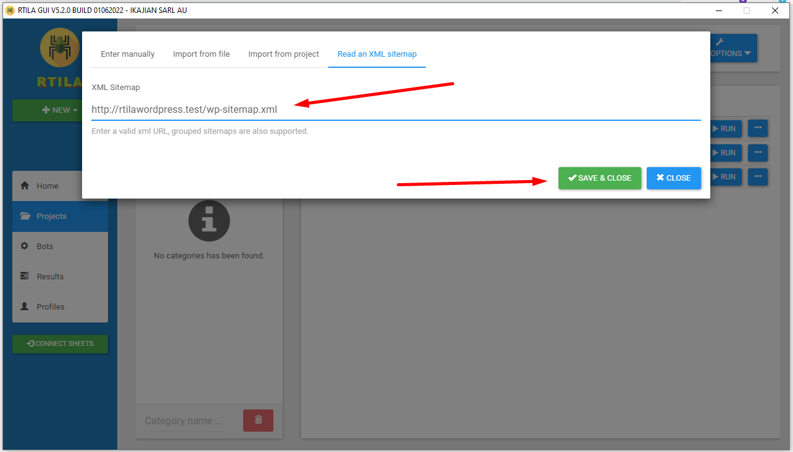